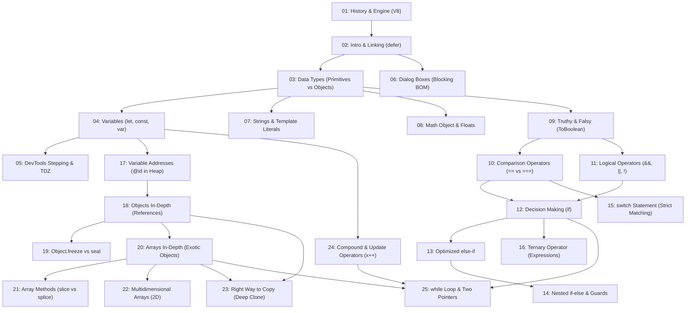

# Module 01: JavaScript Fundamentals (Ep.01 → Ep.25)
### Master Study Guide, Curriculum Manifest & Architectural Index

> **Module Philosophy:** Don't memorize syntax blindly. Build precise mental models of the JavaScript engine, see your variables being allocated in memory using Chrome DevTools, and master the core language semantics so you never fear a technical interview question.

---

## 🧭 Course Orientation & Orientation Trailer Summary

In the course orientation (*Ep.00 Trailer — Zero to Advanced JavaScript*), instructor Anurag Singh establishes the core mission of this curriculum:
- **JavaScript is everywhere:** It powers web frontends, backend servers (Node.js), mobile applications (React Native for Facebook, Instagram, Discord), and cross-platform desktop applications (Electron for VS Code, Slack, Microsoft Teams, WhatsApp).
- **Zero prior coding required:** The series starts from the absolute foundation of how computers interpret text, building upwards to production engineering.
- **Visual & Debugger-First Approach:** Instead of dry slide decks, concepts are taught by stepping through execution line-by-line inside Chrome DevTools, visualizing the memory heap, and proving behavior directly on the blackboard.

---

## 🗺️ 3-Phase Learning Roadmap

```
PHASE 1: ENGINE, SYNTAX & FOUNDATIONS (Ep.01 → Ep.08)
├── Ep.01: History of JavaScript & Engine Evolution (Brendan Eich, V8, JIT)
├── Ep.02: Introduction to JavaScript, Linking Scripts & DevTools REPL
├── Ep.03: Data Types (Primitives vs Objects, typeof null bug)
├── Ep.04: Variables In-Depth (let, const, var, Identifier Rules)
├── Ep.05: DevTools Stepping (Memory Creation Phase vs Code Execution Phase, TDZ)
├── Ep.06: Dialog Boxes (alert, confirm, prompt, Synchronous Thread Blocking)
├── Ep.07: Strings, Template Literals & Methods (Immutability, Autoboxing)
└── Ep.08: The Math Object (Static Methods, Rounding, Random Range Formula)
                    │
                    ▼
PHASE 2: OPERATORS, BOOLEANS & CONTROL FLOW (Ep.09 → Ep.16)
├── Ep.09: Truthy and Falsy Values (The 8 Falsy Values, ToBoolean)
├── Ep.10: Comparison Operators (== vs ===, Relational Coercion, null >= 0 quirk)
├── Ep.11: Logical Operators (&&, ||, !, Short-Circuiting, Value Returns)
├── Ep.12: Decision Making with if (Branching, Block Scope, Accidental Assignment)
├── Ep.13: Optimizing with else if (Cascading Waterfall, Short-Circuit Skipping)
├── Ep.14: Nested if-else (Multi-tier Checks, Pyramid of Doom, Guard Clauses)
├── Ep.15: The switch Statement (Strict Matching, Fall-Through, switch(true))
└── Ep.16: The Ternary Operator (Statements vs Expressions, JSX Patterns)
                    │
                    ▼
PHASE 3: MEMORY, REFERENCE TYPES, COLLECTIONS & LOOPS (Ep.17 → Ep.25)
├── Ep.17: Inspecting Variable Addresses in DevTools (Heap Snapshots, @id)
├── Ep.18: Objects In-Depth (Literals, Dot vs Bracket, Dynamic Keys)
├── Ep.19: Object.freeze() vs Object.seal() (Property Descriptors, Shallow Freeze)
├── Ep.20: Arrays In-Depth (Exotic Objects, Indexing, Length Mutation)
├── Ep.21: Array Methods (Mutating vs Non-Mutating, slice vs splice, sort trap)
├── Ep.22: Multidimensional Arrays (2D Matrices, Jagged Arrays, .fill([]) bug)
├── Ep.23: The Right Way to Copy (Reference vs Shallow vs structuredClone)
├── Ep.24: Compound Assignment & Update Operators (Prefix ++x vs Postfix x++)
└── Ep.25: The while Loop (Loop Lifecycle, Infinite Loop Crash, Two-Pointers)
```

---

## 📑 Complete Topic Manifest & Lesson Links

| Episode | Title & Topic | File Link | YouTube Link | Duration | Core Mental Model / Key Takeaway |
| :---: | :--- | :--- | :---: | :---: | :--- |
| **01** | **The Story of JavaScript** | [01-story-of-javascript.md](file:///c:/Users/admin/Documents/GitHub/complete-resources/JavaScript%20Notes/01-fundamentals/01-story-of-javascript.md) | [Watch on YouTube](https://www.youtube.com/watch?v=5JFrFM3pj5s) | 30:10 | Built in 10 days by Brendan Eich; JIT compiled by V8 (Ignition + TurboFan). |
| **02** | **Introduction to JavaScript** | [02-introduction-to-javascript.md](file:///c:/Users/admin/Documents/GitHub/complete-resources/JavaScript%20Notes/01-fundamentals/02-introduction-to-javascript.md) | [Watch on YouTube](https://www.youtube.com/watch?v=-lBfLogYtZk) | 37:26 | HTML is skeleton, CSS is paint, JS is nervous system; `<script defer>` avoids parser blocking. |
| **03** | **Data Types in JavaScript** | [03-data-types-in-javascript.md](file:///c:/Users/admin/Documents/GitHub/complete-resources/JavaScript%20Notes/01-fundamentals/03-data-types-in-javascript.md) | [Watch on YouTube](https://www.youtube.com/watch?v=-3H3XJHwzRI) | 38:03 | Primitives are immutable granite blocks; `typeof null === 'object'` is a 1995 type tag bug. |
| **04** | **Variables Explained in Depth** | [04-javascript-variables-explained-in-depth.md](file:///c:/Users/admin/Documents/GitHub/complete-resources/JavaScript%20Notes/01-fundamentals/04-javascript-variables-explained-in-depth.md) | [Watch on YouTube](https://www.youtube.com/watch?v=RFx0PnTqxfI) | 65:19 | `const` locks the binding pointer, not the object; `undefined` is a value, `not defined` is a ReferenceError. |
| **05** | **Line-by-Line in DevTools** | [05-watch-your-code-running-line-by-line-in-dev-tools.md](file:///c:/Users/admin/Documents/GitHub/complete-resources/JavaScript%20Notes/01-fundamentals/05-watch-your-code-running-line-by-line-in-dev-tools.md) | [Watch on YouTube](https://www.youtube.com/watch?v=FMhPjmO0ziE) | 46:15 | Two execution phases: Memory Creation Phase allocates slots; Code Execution runs line-by-line. |
| **06** | **Dialog Boxes (alert, confirm, prompt)**| [06-dialog-boxes-in-javascript.md](file:///c:/Users/admin/Documents/GitHub/complete-resources/JavaScript%20Notes/01-fundamentals/06-dialog-boxes-in-javascript.md) | [Watch on YouTube](https://www.youtube.com/watch?v=aHayyIbxIAo) | 15:03 | Synchronous checkpoints that freeze the main thread event loop; prompt returns `null` on Cancel. |
| **07** | **Template Literals & Strings** | [07-template-literals-string-methods-and-properties.md](file:///c:/Users/admin/Documents/GitHub/complete-resources/JavaScript%20Notes/01-fundamentals/07-template-literals-string-methods-and-properties.md) | [Watch on YouTube](https://www.youtube.com/watch?v=Z4x2EgRkJ1g) | 79:46 | Strings are immutable UTF-16 sequences; Autoboxing creates temporary object wrappers for methods. |
| **08** | **The Math Object** | [08-math-object-in-javascript.md](file:///c:/Users/admin/Documents/GitHub/complete-resources/JavaScript%20Notes/01-fundamentals/08-math-object-in-javascript.md) | [Watch on YouTube](https://www.youtube.com/watch?v=H3-1EQW2evA) | 50:00 | Static namespace (no `new Math()`); `Math.floor(Math.random() * (max - min + 1)) + min`. |
| **09** | **Truthy and Falsy Values** | [09-truthy-and-falsy-values.md](file:///c:/Users/admin/Documents/GitHub/complete-resources/JavaScript%20Notes/01-fundamentals/09-truthy-and-falsy-values.md) | [Watch on YouTube](https://www.youtube.com/watch?v=UPARgGhfb5E) | 07:16 | Exactly 8 falsy values in modern JS; empty objects `{}` and arrays `[]` are strictly truthy! |
| **10** | **Comparison Operators** | [10-comparison-operators-in-javascript.md](file:///c:/Users/admin/Documents/GitHub/complete-resources/JavaScript%20Notes/01-fundamentals/10-comparison-operators-in-javascript.md) | [Watch on YouTube](https://www.youtube.com/watch?v=HVhD13U5Bh0) | 23:43 | `===` checks type and value; `null >= 0` is true because `>=` evaluates as `!(null < 0)`. |
| **11** | **Logical Operators (&&, \|\|, !)** | [11-logical-operators-in-javascript.md](file:///c:/Users/admin/Documents/GitHub/complete-resources/JavaScript%20Notes/01-fundamentals/11-logical-operators-in-javascript.md) | [Watch on YouTube](https://www.youtube.com/watch?v=hjSSoCRU_nc) | 58:02 | `&&` stops at first falsy; `\|\|` stops at first truthy; they return the operand itself! |
| **12** | **Decision Making with if** | [12-decision-making-using-if-statement.md](file:///c:/Users/admin/Documents/GitHub/complete-resources/JavaScript%20Notes/01-fundamentals/12-decision-making-using-if-statement.md) | [Watch on YouTube](https://www.youtube.com/watch?v=6-dv7UETgJg) | 57:12 | Railway track switch; floating semicolon `if (x);` causes unconditional execution. |
| **13** | **Optimizing with else if** | [13-optimize-decision-making-using-else-if-and-else.md](file:///c:/Users/admin/Documents/GitHub/complete-resources/JavaScript%20Notes/01-fundamentals/13-optimize-decision-making-using-else-if-and-else.md) | [Watch on YouTube](https://www.youtube.com/watch?v=7lld3Xk5usQ) | 48:06 | Cascading waterfall halts on first match; order conditions from most specific to least specific. |
| **14** | **Nested if-else Statements** | [14-nested-if-else-statement-in-javascript.md](file:///c:/Users/admin/Documents/GitHub/complete-resources/JavaScript%20Notes/01-fundamentals/14-nested-if-else-statement-in-javascript.md) | [Watch on YouTube](https://www.youtube.com/watch?v=Hc0O0u9C_u4) | 17:40 | Inner checks require outer success; refactor Arrow Anti-Pattern using Guard Clauses (Early Return). |
| **15** | **The switch Statement** | [15-switch-statement-in-javascript.md](file:///c:/Users/admin/Documents/GitHub/complete-resources/JavaScript%20Notes/01-fundamentals/15-switch-statement-in-javascript.md) | [Watch on YouTube](https://www.youtube.com/watch?v=ebJVbq6BDFI) | 51:51 | Compares via `===`; missing `break;` plummets through subsequent cases (Fall-Through). |
| **16** | **The Ternary Operator** | [16-ternary-operator-in-javascript.md](file:///c:/Users/admin/Documents/GitHub/complete-resources/JavaScript%20Notes/01-fundamentals/16-ternary-operator-in-javascript.md) | [Watch on YouTube](https://www.youtube.com/watch?v=uO0RRCBsEIY) | 22:46 | Statement vs Expression; ternary returns a value, allowing direct assignment to `const` and JSX use. |
| **17** | **Variable Memory Addresses** | [17-how-to-see-variable-address-in-dev-tools.md](file:///c:/Users/admin/Documents/GitHub/complete-resources/JavaScript%20Notes/01-fundamentals/17-how-to-see-variable-address-in-dev-tools.md) | [Watch on YouTube](https://www.youtube.com/watch?v=Gqlv6inCZqI) | 53:31 | DevTools Memory tab Heap Snapshots expose `@id` pointers; Shallow Size vs Retained Size. |
| **18** | **Objects Explained in Depth** | [18-objects-in-javascript-explained-in-depth.md](file:///c:/Users/admin/Documents/GitHub/complete-resources/JavaScript%20Notes/01-fundamentals/18-objects-in-javascript-explained-in-depth.md) | [Watch on YouTube](https://www.youtube.com/watch?v=1Rhdtq5pYoY) | 63:40 | Manila folder mental model; bracket notation `obj[key]` is mandatory for dynamic variables/symbols. |
| **19** | **Object.freeze() vs seal()** | [19-object-freeze-vs-object-seal.md](file:///c:/Users/admin/Documents/GitHub/complete-resources/JavaScript%20Notes/01-fundamentals/19-object-freeze-vs-object-seal.md) | [Watch on YouTube](https://www.youtube.com/watch?v=K2v08vu-tK0) | 29:54 | `seal` prevents add/delete; `freeze` prevents add/delete/edit; freeze is strictly shallow! |
| **20** | **Arrays Explained in Depth** | [20-arrays-explained-in-depth.md](file:///c:/Users/admin/Documents/GitHub/complete-resources/JavaScript%20Notes/01-fundamentals/20-arrays-explained-in-depth.md) | [Watch on YouTube](https://www.youtube.com/watch?v=xerUjcKdA0o) | 43:34 | Exotic objects with synchronized `.length`; `delete arr[i]` leaves holes; use `Array.isArray()`. |
| **21** | **Most Common Array Methods** | [21-most-common-array-methods-in-javascript.md](file:///c:/Users/admin/Documents/GitHub/complete-resources/JavaScript%20Notes/01-fundamentals/21-most-common-array-methods-in-javascript.md) | [Watch on YouTube](https://www.youtube.com/watch?v=RTfNjbqQokI) | 39:07 | `slice()` is pure/immutable; `splice()` mutates in-place; numbers need a comparator `(a, b) => a - b`. |
| **22** | **Multidimensional Arrays** | [22-multidimensional-arrays.md](file:///c:/Users/admin/Documents/GitHub/complete-resources/JavaScript%20Notes/01-fundamentals/22-multidimensional-arrays.md) | [Watch on YouTube](https://www.youtube.com/watch?v=hhO8aiDgN9A) | 14:41 | Jagged arrays of pointers; `grid[row][col]`; avoid `new Array(3).fill([])` reference duplication. |
| **23** | **The Right Way to Copy** | [23-right-way-to-copy-objects-and-arrays.md](file:///c:/Users/admin/Documents/GitHub/complete-resources/JavaScript%20Notes/01-fundamentals/23-right-way-to-copy-objects-and-arrays.md) | [Watch on YouTube](https://www.youtube.com/watch?v=l_YFa0SKqtY) | 51:40 | Spread `{ ...obj }` is shallow; `structuredClone()` is the native standard for recursive deep cloning. |
| **24** | **Compound & Update Operators** | [24-combined-assignment-operators.md](file:///c:/Users/admin/Documents/GitHub/complete-resources/JavaScript%20Notes/01-fundamentals/24-combined-assignment-operators.md) | [Watch on YouTube](https://www.youtube.com/watch?v=AnVdRB2n7kg) | 27:29 | `x += 5`; `x++` evaluates old value first; `++x` increments before evaluating; `x = x++` self-resets! |
| **25** | **The while Loop in JavaScript** | [25-while-loop-in-javascript.md](file:///c:/Users/admin/Documents/GitHub/complete-resources/JavaScript%20Notes/01-fundamentals/25-while-loop-in-javascript.md) | [Watch on YouTube](https://www.youtube.com/watch?v=IoDfreDgTgM) | 29:58 | 4 loop pillars; missing stepper locks CPU main thread in infinite loop; Two-Pointer pattern. |

---

## 🔗 Cross-Topic Dependency Graph



---

## ⚡ 25-Question FAANG Quick Reference / Active Recall Cheat Sheet

Test your retention across all 25 fundamental concepts before an interview:

<details>
<summary><b>1. Why is <code>typeof null === 'object'</code> in JavaScript?</b></summary>

In the original 1995 JavaScript implementation, values were stored with a 3-bit type tag. The tag `000` represented an Object reference. `null` was represented as the NULL pointer (`0x00`), which had all zero bits, causing the engine to read its tag as `000` (Object). This is preserved for backward web compatibility.
</details>

<details>
<summary><b>2. What is the difference between <code>undefined</code> and <code>not defined</code>?</b></summary>

`undefined` is a valid primitive value assigned to an allocated variable slot that hasn't received a value yet. `not defined` is a fatal engine `ReferenceError` thrown when code references an identifier that was never declared in any accessible scope.
</details>

<details>
<summary><b>3. What is the Temporal Dead Zone (TDZ)?</b></summary>

The time window between entering a block scope and the physical execution of a `let` or `const` declaration line. The variable's memory binding exists, but reading or writing to it throws a `ReferenceError: Cannot access 'x' before initialization`.
</details>

<details>
<summary><b>4. Why does <code>const obj = {}</code> allow mutating properties inside the object?</b></summary>

Because `const` creates an immutable binding between the variable identifier and its memory address on the heap. You cannot reassign the variable to point to a different address (`obj = {}`), but the contents of the heap object at that address remain fully mutable.
</details>

<details>
<summary><b>5. Why does <code>[10, 5, 25, 40].sort()</code> not sort numbers in ascending order?</b></summary>

By default, `Array.prototype.sort()` converts all elements to strings and compares them lexicographically by UTF-16 code units (`"10"` comes before `"25"`, which comes before `"5"`). To sort numbers numerically, you must pass a comparator: `.sort((a, b) => a - b)`.
</details>

<details>
<summary><b>6. What are the 8 Falsy values in ECMAScript?</b></summary>

`false`, `0`, `-0`, `0n` (BigInt zero), `""` (empty string), `null`, `undefined`, and `NaN`. (Plus the historical host object `document.all` in browsers).
</details>

<details>
<summary><b>7. Why is <code>null >= 0</code> true, but <code>null > 0</code> and <code>null == 0</code> are both false?</b></summary>

`null == 0` is `false` because loose equality only equates `null` with `undefined`. Relational operators (`>`, `<`) convert `null` to `0` via `ToNumeric`, making `0 > 0` `false`. However, `>=` is evaluated as `!(null < 0)` $\to$ `!(0 < 0)` $\to$ `!(false)` $\to$ `true`.
</details>

<details>
<summary><b>8. What do logical operators (<code>&&</code> and <code>\|\|</code>) actually return?</b></summary>

They do not return booleans by default; they return the actual operand that determined the result! `&&` returns the first falsy operand (or the last operand if all are truthy); `\|\|` returns the first truthy operand (or the last operand if all are falsy).
</details>

<details>
<summary><b>9. Why is <code>??</code> (Nullish Coalescing) preferred over <code>\|\|</code> for default values?</b></summary>

`\|\|` treats valid numeric zero `0` and empty strings `""` as falsy, triggering the fallback value accidentally. `??` triggers the fallback only if the left operand is strictly `null` or `undefined`.
</details>

<details>
<summary><b>10. What is the "Floating Semicolon" bug in conditional statements?</b></summary>

Placing a semicolon directly after the `if (...)` condition (e.g. `if (age >= 18); { drive(); }`) terminates the conditional statement with an empty statement. The curly braces `{ drive(); }` become an independent block statement that executes unconditionally regardless of the condition.
</details>

<details>
<summary><b>11. What is the difference between a Statement and an Expression?</b></summary>

An Expression produces and resolves to a concrete value (e.g. `5 + 2`, ternary `a ? b : c`). A Statement performs an action or controls program execution flow (e.g. `if-else`, `while`, `switch`) and cannot be assigned to variables or used inside `${}`.
</details>

<details>
<summary><b>12. What is Case Fall-Through in a <code>switch</code> statement?</b></summary>

When a matching `case` does not end with a `break` statement, execution falls through and executes the code of all subsequent cases sequentially, regardless of whether their case expressions match, until a `break` or closing brace is reached.
</details>

<details>
<summary><b>13. Why does <code>new Math()</code> throw a TypeError?</b></summary>

Because `Math` is a static namespace object, not a constructor function. It lacks an internal `[[Construct]]` method. All properties and functions on `Math` are accessed statically.
</details>

<details>
<summary><b>14. What is String Autoboxing?</b></summary>

When a property or method is called on a primitive string (`"hello".toUpperCase()`), JavaScript temporarily wraps the primitive in a transient `new String("hello")` object wrapper, executes the prototype method, returns the resulting primitive, and discards the wrapper object for garbage collection.
</details>

<details>
<summary><b>15. What is the difference between <code>slice()</code> and <code>splice()</code> on arrays?</b></summary>

`slice(start, end)` is non-mutating and returns a new sub-array without touching the original. `splice(start, deleteCount, ...items)` mutates the original array in-place, removing and optionally inserting elements, and returns an array containing the deleted items.
</details>

<details>
<summary><b>16. What happens if you use <code>delete arr[i]</code> on an array?</b></summary>

It removes the property at index `i` and leaves an empty slot (a hole / sparse array). It does not shift subsequent elements and does not decrement the array's `.length`.
</details>

<details>
<summary><b>17. Why is <code>new Array(3).fill([])</code> dangerous when initializing a matrix?</b></summary>

Because `.fill()` assigns the exact same array reference pointer in heap memory to every row. Mutating row 0 (`grid[0].push(1)`) modifies the shared instance, reflecting across all 3 rows.
</details>

<details>
<summary><b>18. What is the technical difference between <code>Object.seal()</code> and <code>Object.freeze()</code>?</b></summary>

Both prevent adding new properties and deleting existing properties (`configurable: false`). However, `Object.freeze()` additionally marks all existing data properties as non-writable (`writable: false`), preventing values from being modified.
</details>

<details>
<summary><b>19. Why does <code>Object.freeze()</code> fail to prevent modifications to nested child objects?</b></summary>

Because `Object.freeze()` is strictly shallow. It freezes the direct memory block of the parent object. A nested object property merely holds a pointer to another memory block in the heap; that pointer cannot be reassigned, but the target child block remains mutable unless recursively deep-frozen.
</details>

<details>
<summary><b>20. What is the difference between a Shallow Copy and a Deep Copy?</b></summary>

A shallow copy duplicates the top-level container, but any nested objects or arrays are copied by reference (sharing memory). A deep copy recursively duplicates every nested object and array so no memory addresses are shared.
</details>

<details>
<summary><b>21. What is the modern native standard for deep copying in JavaScript?</b></summary>

`structuredClone(value)`. It creates true deep clones and handles circular references, but throws an error if the object contains functions or DOM nodes.
</details>

<details>
<summary><b>22. What are the 5 fatal flaws of <code>JSON.parse(JSON.stringify(obj))</code>?</b></summary>

1. Discards functions.
2. Discards `undefined`.
3. Discards `Symbol` keys.
4. Converts `Date` objects to ISO strings.
5. Throws an unrecoverable `TypeError` on circular references.
</details>

<details>
<summary><b>23. What is the difference between <code>let b = a++</code> and <code>let b = ++a</code>?</b></summary>

Postfix `a++` evaluates and assigns the current (un-incremented) value to `b`, then increments `a` in memory. Prefix `++a` increments `a` in memory first, then evaluates and assigns the new incremented value to `b`.
</details>

<details>
<summary><b>24. Why does <code>count = count++</code> fail to increment <code>count</code>?</b></summary>

Postfix `count++` increments `count` in memory, but returns the old un-incremented value to the assignment operator `=`. The assignment then immediately overwrites `count` with the old value.
</details>

<details>
<summary><b>25. What happens to the browser when an infinite synchronous <code>while</code> loop runs?</b></summary>

Because JavaScript runs on a single thread, an infinite synchronous loop monopolizes 100% of the CPU core, completely starving the Event Loop. DOM rendering, timers, network callbacks, and user inputs freeze until the browser prompts the user to force-kill the page.
</details>

---

## 🚀 Moving to the Next Module

You have completed **Module 01: JavaScript Fundamentals (Ep.01 → Ep.25)**!  
- For DOM manipulation, Event Bubbling/Capturing, Event Delegation, and Web Storage, continue directly to **[Module 08: DOM, Events & Web Storage (Ep.51 → Ep.68)](file:///c:/Users/admin/Documents/GitHub/complete-resources/JavaScript%20Notes/08-dom-events-storage/00-master-index.md)**.
