# Master Curriculum Index: Complete JavaScript Notes (Ep. 01 – Ep. 68)

> **Curriculum Source:** Anurag Singh — *Complete JavaScript Course (ProCodrr)*  
> **Scope Covered:** 
> - **Module 01: Core JavaScript Fundamentals (Ep. 01 → Ep. 25)**: V8 Engine, Execution Context, Scopes, Primitives vs Objects, Stack vs Heap, Operators, Control Flow, Collections, Deep Cloning, Loops.
> - **Module 08: DOM, Modern Events Architecture & Web Storage (Ep. 51 → Ep. 68)**: Critical Rendering Path, DOM Tree Traversal & Mutation, Modern Event Subsystem, Event Bubbling & Capturing, Event Delegation, Synthetic Events, Web Storage API.  
> **Level:** Beginner to Senior / FAANG-Ready Deep Dive  
> **Language & Standard:** 100% Technical English | ECMAScript 2024+ / WHATWG DOM Standard  

---

## 🧭 Curriculum Philosophy & Orientation

1. **Don't Memorize Syntax Blindly:** Build concrete, visual mental models of the underlying engine (V8, Ignition, TurboFan) and the browser rendering pipeline (DOM, CSSOM, Render Tree, Reflow, Repaint).
2. **Visual & Debugger-First Approach:** Step through code line-by-line using Chrome DevTools (**Sources**, **Call Stack**, **Scope**, **Memory Heap Snapshots**) to verify exactly how variables and nodes are created, updated, and collected.
3. **Spec-Grounded Accuracy:** Clearly distinguish between universal language guarantees (ECMAScript specification), web platform APIs (W3C / WHATWG DOM & HTML standards), and browser-specific engine heuristics (V8 pointer compression, hidden classes, layout tree flushes).

---

## 📚 How to Study These Notes

For every lecture note:

1. **Read "The Idea in Simple Words"** — Build immediate intuition without initial jargon.
2. **Anchor the "Mental Model"** — Connect the technical mechanism to a memorable physical analogy.
3. **Run the "Smallest Useful Example"** — Paste it in DevTools Console and observe the output.
4. **Study "What Just Happened?" and "Visualize It"** — Trace the state changes step-by-step.
5. **Answer "🧠 Brain Triggers & Confusion Checks"** — Challenge intuitive assumptions with active recall.
6. **Review "Common Mistakes & Anti-Patterns"** — Understand the exact bugs (`❌ Wrong` $\to$ `Why?` $\to$ `✅ Correct`).
7. **Solve "🎯 Interview Deep Dive"** — Test yourself with "Predict First" output traces and architectural questions.
8. **Revisit "🔬 Optional Deep Dive" When Ready** — Explore low-level V8 bytecode and specification algorithms.
9. **Lock It In with "⚡ 30-Second Revision"** — Review the 5 essential revision pillars before moving forward.
10. **Execute the "🛠️ Tiny Practice Task"** — Solidify learning through hands-on console experiments.

### 🏷️ Knowledge Level Indicators

Throughout these notes, concepts and deep dives are tagged with explicit knowledge badges:

- 🟢 **MUST KNOW**: Non-negotiable core knowledge required for everyday software engineering.
- 🟡 **SHOULD KNOW**: Essential for robust application design, clean architecture, and technical interviews.
- 🔵 **DEEP DIVE**: Advanced conceptual mechanics and edge cases. Optional on your first reading pass.
- ⚫ **IMPLEMENTATION DETAIL**: Engine-specific heuristics (e.g., V8, Chromium, Blink). Valuable context, but not guaranteed across all web hosts.

---

## 🗺️ 6-Phase Comprehensive Learning Roadmap

```
PHASE 1: ENGINE, SYNTAX & FOUNDATIONS (Ep.01 → Ep.08)
├── Ep.01: History of JavaScript & Engine Evolution (Brendan Eich, V8, JIT)
├── Ep.02: Introduction to JavaScript, Linking Scripts (<script defer> vs async)
├── Ep.03: Data Types (7 Primitives vs Objects, typeof null legacy quirk)
├── Ep.04: Variables In-Depth (let, const, var, Identifier Rules, TDZ)
├── Ep.05: DevTools Stepping (Environment Setup vs Code Execution Phase, TDZ)
├── Ep.06: Dialog Boxes (alert, confirm, prompt, Synchronous Event-Loop Blocking)
├── Ep.07: Strings, Template Literals & Methods (Immutability, Autoboxing)
└── Ep.08: The Math Object (Static Methods, IEEE 754 Floats, Random Range Formula)
                    │
                    ▼
PHASE 2: OPERATORS, BOOLEANS & CONTROL FLOW (Ep.09 → Ep.16)
├── Ep.09: Truthy and Falsy Values (The 8 Falsy Values, ToBoolean coercion)
├── Ep.10: Comparison Operators (== vs ===, Relational Coercion, null >= 0 paradox)
├── Ep.11: Logical Operators (&&, ||, !, Short-Circuiting, Operand Returns)
├── Ep.12: Decision Making with if (Branching, Block Scope, Floating Semicolon)
├── Ep.13: Optimizing with else if (Cascading Waterfall, Short-Circuit Skipping)
├── Ep.14: Nested if-else (Multi-tier Checks, Pyramid of Doom, Guard Clauses)
├── Ep.15: The switch Statement (Strict Matching, Fall-Through, switch(true))
└── Ep.16: The Ternary Operator (Statements vs Expressions, JSX Patterns)
                    │
                    ▼
PHASE 3: MEMORY, REFERENCE TYPES, COLLECTIONS & LOOPS (Ep.17 → Ep.25)
├── Ep.17: Inspecting Object References in DevTools (Heap Snapshots, @id profiler)
├── Ep.18: Objects In-Depth (Literals, Dot vs Bracket, Dynamic Keys, hasOwn)
├── Ep.19: Object.freeze() vs Object.seal() (Property Descriptors, Shallow Freeze)
├── Ep.20: Arrays In-Depth (Exotic Objects, Indexing, Length Mutation, Holes)
├── Ep.21: Array Methods (Mutating vs Non-Mutating, slice vs splice, sort trap)
├── Ep.22: Multidimensional Arrays (2D Matrices, Jagged Arrays, .fill([]) bug)
├── Ep.23: The Right Way to Copy (Reference vs Shallow vs structuredClone)
├── Ep.24: Compound Assignment & Update Operators (Prefix ++x vs Postfix x++)
└── Ep.25: The while Loop (Loop Lifecycle, Infinite Loop Crash, Two-Pointers)
                    │
                    ▼
PHASE 4: DOM FOUNDATIONS & SELECTORS (Ep.51 → Ep.55)
├── Ep.51: Introduction to DOM (Render Tree, window vs document, Operating Table)
├── Ep.52: Selecting Elements (getElementById, querySelector, Live vs Static)
├── Ep.53: innerText vs textContent (Layout Reflows, Script vs Spectator, XSS)
├── Ep.54: getAttribute & setAttribute (HTML Attributes vs Live DOM Properties)
└── Ep.55: How to Apply Styles in JS (classList API vs Inline style sledgehammer)
                    │
                    ▼
PHASE 5: DOM TREE NAVIGATION & MANIPULATION (Ep.56 → Ep.60)
├── Ep.56: Access Family Elements (parentElement, children, Element vs Node traversal)
├── Ep.57: Difference Between Element and Node (Taxonomy, nodeType, Whitespace)
├── Ep.58: append vs appendChild (Variadic appending, DOMStrings, Modern API)
├── Ep.59: Creating Elements in JS (createElement, DocumentFragment batching)
└── Ep.60: Removing Elements in JS (element.remove(), Detached DOM Memory Leaks)
                    │
                    ▼
PHASE 6: EVENT SUBSYSTEM, DELEGATION & CLIENT STORAGE (Ep.61 → Ep.68)
├── Ep.61: Event Listeners In-Depth (Observer Pattern, Anonymous Unbinding Trap)
├── Ep.62: Form Event and Event Object (submit, preventDefault, e.target vs currentTarget)
├── Ep.63: Keyboard Events (keydown, keyup, e.key semantic vs e.code hardware)
├── Ep.64: Mouse, Touch & Pointer Events (mouseenter vs mouseover, PointerEvents)
├── Ep.65: Event Bubbling & Capturing (3-Phase Flow, stopPropagation vs stopImmediate)
├── Ep.66: Event Simulation in JS (dispatchEvent, form.requestSubmit, event.isTrusted)
├── Ep.67: Event Delegation in JS (Lobby Receptionist, e.target.closest(), Memory Scale)
└── Ep.68: Local Storage & Master Revision (Web Storage API, Quotas, XSS, Master Sheet)
```

---

## 📑 Complete 43-Episode Topic Manifest & Lesson Links

| Ep. | Title & Topic | File Link | Video Link | Core Mental Model / Key Takeaway |
| :---: | :--- | :--- | :---: | :--- |
| **01** | **The Story of JavaScript** | [01-story-of-javascript.md](./01-story-of-javascript.md) | [Watch on YouTube](https://www.youtube.com/watch?v=5JFrFM3pj5s) | Built in 10 days by Brendan Eich; modern JIT execution combines bytecode with TurboFan optimization. |
| **02** | **Introduction to JavaScript** | [02-introduction-to-javascript.md](./02-introduction-to-javascript.md) | [Watch on YouTube](https://www.youtube.com/watch?v=-lBfLogYtZk) | HTML is skeleton, CSS is paint, JS is nervous system; `<script defer>` avoids HTML parser blocking. |
| **03** | **Data Types in JavaScript** | [03-data-types-in-javascript.md](./03-data-types-in-javascript.md) | [Watch on YouTube](https://www.youtube.com/watch?v=-3H3XJHwzRI) | Primitives are immutable values; `typeof null === 'object'` is a permanent historical legacy quirk. |
| **04** | **Variables Explained in Depth** | [04-javascript-variables-explained-in-depth.md](./04-javascript-variables-explained-in-depth.md) | [Watch on YouTube](https://www.youtube.com/watch?v=RFx0PnTqxfI) | `const` creates an immutable identifier binding; `undefined` is a value, `not defined` is a ReferenceError. |
| **05** | **Line-by-Line in DevTools** | [05-watch-your-code-running-line-by-line-in-dev-tools.md](./05-watch-your-code-running-line-by-line-in-dev-tools.md) | [Watch on YouTube](https://www.youtube.com/watch?v=FMhPjmO0ziE) | Setup phase instantiates bindings; execution runs line-by-line; TDZ protects uninitialized `let`/`const`. |
| **06** | **Dialog Boxes (alert, confirm, prompt)**| [06-dialog-boxes-in-javascript.md](./06-dialog-boxes-in-javascript.md) | [Watch on YouTube](https://www.youtube.com/watch?v=aHayyIbxIAo) | Synchronous checkpoints freezing the tab event loop; prompt returns `null` on Cancel/Escape. |
| **07** | **Template Literals & Strings** | [07-template-literals-string-methods-and-properties.md](./07-template-literals-string-methods-and-properties.md) | [Watch on YouTube](https://www.youtube.com/watch?v=Z4x2EgRkJ1g) | Strings are immutable UTF-16 code units; Autoboxing creates temporary object wrapper semantics. |
| **08** | **The Math Object** | [08-math-object-in-javascript.md](./08-math-object-in-javascript.md) | [Watch on YouTube](https://www.youtube.com/watch?v=H3-1EQW2evA) | Static namespace object (no `new Math()`); `Math.floor(Math.random() * (max - min + 1)) + min`. |
| **09** | **Truthy and Falsy Values** | [09-truthy-and-falsy-values.md](./09-truthy-and-falsy-values.md) | [Watch on YouTube](https://www.youtube.com/watch?v=UPARgGhfb5E) | Exactly 8 falsy values; all objects and arrays (`{}`, `[]`) are unconditionally truthy in `ToBoolean`. |
| **10** | **Comparison Operators** | [10-comparison-operators-in-javascript.md](./10-comparison-operators-in-javascript.md) | [Watch on YouTube](https://www.youtube.com/watch?v=HVhD13U5Bh0) | `===` checks type and value; `null >= 0` is true because `>=` evaluates relational `!(null < 0)`. |
| **11** | **Logical Operators (&&, \|\|, !)** | [11-logical-operators-in-javascript.md](./11-logical-operators-in-javascript.md) | [Watch on YouTube](https://www.youtube.com/watch?v=hjSSoCRU_nc) | `&&` returns first falsy; `\|\|` returns first truthy; operators return the resolving operand itself. |
| **12** | **Decision Making with if** | [12-decision-making-using-if-statement.md](./12-decision-making-using-if-statement.md) | [Watch on YouTube](https://www.youtube.com/watch?v=6-dv7UETgJg) | Railway switch; floating semicolon `if (x);` creates an empty statement, executing block unconditionally. |
| **13** | **Optimizing with else if** | [13-optimize-decision-making-using-else-if-and-else.md](./13-optimize-decision-making-using-else-if-and-else.md) | [Watch on YouTube](https://www.youtube.com/watch?v=7lld3Xk5usQ) | Waterfall short-circuits on first match; order conditions from most restrictive to least restrictive. |
| **14** | **Nested if-else Statements** | [14-nested-if-else-statement-in-javascript.md](./14-nested-if-else-statement-in-javascript.md) | [Watch on YouTube](https://www.youtube.com/watch?v=Hc0O0u9C_u4) | Inner checks require outer truthiness; flatten Pyramid of Doom using Guard Clauses (Early Return). |
| **15** | **The switch Statement** | [15-switch-statement-in-javascript.md](./15-switch-statement-in-javascript.md) | [Watch on YouTube](https://www.youtube.com/watch?v=ebJVbq6BDFI) | Evaluates via `===`; missing `break;` plummets through subsequent cases; case bodies share switch scope. |
| **16** | **The Ternary Operator** | [16-ternary-operator-in-javascript.md](./16-ternary-operator-in-javascript.md) | [Watch on YouTube](https://www.youtube.com/watch?v=uO0RRCBsEIY) | Statement vs Expression; ternary produces a value, allowing direct assignment to `const` and JSX use. |
| **17** | **Variable Object References** | [17-how-to-see-variable-address-in-dev-tools.md](./17-how-to-see-variable-address-in-dev-tools.md) | [Watch on YouTube](https://www.youtube.com/watch?v=Gqlv6inCZqI) | DevTools Memory tab Heap Snapshots expose `@id` instance markers; Shallow Size vs Retained Size. |
| **18** | **Objects Explained in Depth** | [18-objects-in-javascript-explained-in-depth.md](./18-objects-in-javascript-explained-in-depth.md) | [Watch on YouTube](https://www.youtube.com/watch?v=1Rhdtq5pYoY) | Manila folder model; bracket notation `obj[key]` is mandatory for dynamic keys and non-identifiers. |
| **19** | **Object.freeze() vs seal()** | [19-object-freeze-vs-object-seal.md](./19-object-freeze-vs-object-seal.md) | [Watch on YouTube](https://www.youtube.com/watch?v=K2v08vu-tK0) | `seal` blocks add/delete; `freeze` blocks add/delete/edit; freezing is strictly shallow! |
| **20** | **Arrays Explained in Depth** | [20-arrays-explained-in-depth.md](./20-arrays-explained-in-depth.md) | [Watch on YouTube](https://www.youtube.com/watch?v=xerUjcKdA0o) | Exotic objects with synchronized `.length`; `delete arr[i]` leaves holes; test via `Array.isArray()`. |
| **21** | **Most Common Array Methods** | [21-most-common-array-methods-in-javascript.md](./21-most-common-array-methods-in-javascript.md) | [Watch on YouTube](https://www.youtube.com/watch?v=RTfNjbqQokI) | `slice()` is pure/immutable; `splice()` mutates in-place; numbers need a comparator `(a, b) => a - b`. |
| **22** | **Multidimensional Arrays** | [22-multidimensional-arrays.md](./22-multidimensional-arrays.md) | [Watch on YouTube](https://www.youtube.com/watch?v=hhO8aiDgN9A) | Jagged arrays of object references; `grid[row][col]`; avoid `new Array(3).fill([])` reference trap. |
| **23** | **The Right Way to Copy** | [23-right-way-to-copy-objects-and-arrays.md](./23-right-way-to-copy-objects-and-arrays.md) | [Watch on YouTube](https://www.youtube.com/watch?v=l_YFa0SKqtY) | Spread `{ ...obj }` is shallow; `structuredClone()` is the native standard for recursive deep cloning. |
| **24** | **Compound & Update Operators** | [24-combined-assignment-operators.md](./24-combined-assignment-operators.md) | [Watch on YouTube](https://www.youtube.com/watch?v=AnVdRB2n7kg) | `x += 5`; `x++` evaluates old value first; `++x` increments before evaluating; `x = x++` self-resets! |
| **25** | **The while Loop in JavaScript** | [25-while-loop-in-javascript.md](./25-while-loop-in-javascript.md) | [Watch on YouTube](https://www.youtube.com/watch?v=IoDfreDgTgM) | 4 loop pillars; missing stepper causes infinite loop that starves execution thread; Two-Pointer pattern. |
| **51** | **Introduction to DOM** | [51-introduction-to-dom.md](./51-introduction-to-dom.md) | [Watch on YouTube](https://www.youtube.com/watch?v=m2TpNXtT4Cs) | DOM is the live operating table for HTML; `window` is the environment host, `document` is the page root. |
| **52** | **Selecting Elements in JS** | [52-selecting-elements-in-javascript.md](./52-selecting-elements-in-javascript.md) | [Watch on YouTube](https://www.youtube.com/watch?v=fOKfCNk7TMA) | `getElementById` is a laser pointer; `querySelector` is a GPS scanner; Live vs Static collections. |
| **53** | **innerText vs textContent** | [53-difference-between-innertext-and-textcontent.md](./53-difference-between-innertext-and-textcontent.md) | [Watch on YouTube](https://www.youtube.com/watch?v=83u35YfNE1w) | `textContent` reads raw text without layout; `innerText` flushes layout and respects CSS styling. |
| **54** | **getAttribute & setAttribute** | [54-getattribute-and-setattribute.md](./54-getattribute-and-setattribute.md) | [Watch on YouTube](https://www.youtube.com/watch?v=38mNZls3lUU) | HTML attributes are initial blueprints; DOM properties are live electrical connections; `dataset` API. |
| **55** | **How to Apply Styles in JS** | [55-how-to-apply-styles-in-javascript.md](./55-how-to-apply-styles-in-javascript.md) | [Watch on YouTube](https://www.youtube.com/watch?v=KW9DiBSVC_c) | Inline `el.style` is a sledgehammer; `classList` (`add`, `remove`, `toggle`) is a clean wardrobe changer. |
| **56** | **Access Family Elements** | [56-access-parent-sibling-and-children-elements.md](./56-access-parent-sibling-and-children-elements.md) | [Watch on YouTube](https://www.youtube.com/watch?v=QK_-jfUIFZE) | Element navigation (`parentElement`, `children`) stays on paved roads; Node navigation walks through grass. |
| **57** | **Difference Between Element and Node** | [57-difference-between-element-and-node.md](./57-difference-between-element-and-node.md) | [Watch on YouTube](https://www.youtube.com/watch?v=zx4AIcl77M0) | Every Element is a Node, but not every Node is an Element; whitespace creates text nodes (`nodeType 3`). |
| **58** | **Difference Between append & appendChild** | [58-difference-between-append-and-appendchild.md](./58-difference-between-append-and-appendchild.md) | [Watch on YouTube](https://www.youtube.com/watch?v=rSX0sYwPnZg) | `appendChild` accepts only a single Node; `append` accepts multiple nodes and converts raw strings. |
| **59** | **Creating Elements in JS** | [59-creating-elements-in-javascript.md](./59-creating-elements-in-javascript.md) | [Watch on YouTube](https://www.youtube.com/watch?v=wl68fLJy_DU) | `DocumentFragment` is a construction hangar; only the fully assembled UI batches into the live DOM tree. |
| **60** | **How to Remove Element Using JS** | [60-how-to-remove-element-using-javascript.md](./60-how-to-remove-element-using-javascript.md) | [Watch on YouTube](https://www.youtube.com/watch?v=TBSNNHYwu1g) | `el.remove()` self-evicts; lingering variable references to removed nodes cause Detached DOM memory leaks. |
| **61** | **Event Listeners In-Depth** | [61-event-listeners-explained-in-depth.md](./61-event-listeners-explained-in-depth.md) | [Watch on YouTube](https://www.youtube.com/watch?v=5mo0xQu4FOM) | Event listener registration uses the Observer pattern; unbinding requires an identical function reference. |
| **62** | **Form Event and Event Object** | [62-form-event-and-event-object.md](./62-form-event-and-event-object.md) | [Watch on YouTube](https://www.youtube.com/watch?v=J5-yOKK--78) | `e.preventDefault()` stops browser navigation; `e.target` is innermost click; `e.currentTarget` is listener host. |
| **63** | **Keyboard Events in JS** | [63-keyboard-events-in-javascript.md](./63-keyboard-events-in-javascript.md) | [Watch on YouTube](https://www.youtube.com/watch?v=crRttpPp_4o) | `e.code` is physical hardware key; `e.key` is semantic character output; IME composition lifecycle. |
| **64** | **Mouse, Touch & Pointer Events** | [64-mouse-events-in-javascript.md](./64-mouse-events-in-javascript.md) | [Watch on YouTube](https://www.youtube.com/watch?v=izxOuK_mhqw) | `mouseenter` does not bubble; `mouseover` bubbles; Pointer Events API unifies mouse, stylus, and touch. |
| **65** | **Event Bubbling & Capturing** | [65-event-bubbling-and-event-capturing.md](./65-event-bubbling-and-event-capturing.md) | [Watch on YouTube](https://www.youtube.com/watch?v=lfRgu5dLh8E) | 3-Phase Flow: Capturing travels down, Target triggers, Bubbling floats up; `stopPropagation` halts hierarchy. |
| **66** | **Event Simulation in JS** | [66-event-simulation-in-javascript.md](./66-event-simulation-in-javascript.md) | [Watch on YouTube](https://www.youtube.com/watch?v=uKupoqAtJBk) | Synthetic dispatching; `form.requestSubmit()` triggers validation; `event.isTrusted` verifies dispatch origin. |
| **67** | **Event Delegation in JS** | [67-event-delegation-in-javascript.md](./67-event-delegation-in-javascript.md) | [Watch on YouTube](https://www.youtube.com/watch?v=-HUZBU0H1VA) | Single ancestor receptionist manages dynamic children via bubbling and `e.target.closest()` matching. |
| **68** | **Local Storage & Master Sheet** | [68-local-storage-explained-in-depth.md](./68-local-storage-explained-in-depth.md) | [Watch on YouTube](https://www.youtube.com/watch?v=1ofttBIG5R8) | Web Storage API (~5MB, synchronous); JSON serialization; XSS security boundaries; Master Revision Sheet. |

---

## 🔗 Unified Cross-Topic Architectural Dependency Graph

```mermaid
flowchart TD
    subgraph Core ["Phase 1 & 2: Language Core & Control Flow"]
        Ep01["01: History & JIT Engine"] --> Ep02["02: Intro & script defer"]
        Ep02 --> Ep03["03: Data Types (Primitives vs Objects)"]
        Ep03 --> Ep04["04: Variables & TDZ"]
        Ep04 --> Ep05["05: DevTools Stepping & Scopes"]
        Ep03 --> Ep07["07: Strings & Autoboxing"]
        Ep03 --> Ep08["08: Math Object & Floats"]
        Ep03 --> Ep09["09: Truthy/Falsy (ToBoolean)"]
        Ep09 --> Ep10["10: Comparison (== vs ===)"]
        Ep09 --> Ep11["11: Logical Operators (Short-Circuit)"]
        Ep10 --> Ep12["12: Decision Making (if)"]
        Ep11 --> Ep12
        Ep12 --> Ep13["13: Optimized else-if"]
        Ep13 --> Ep14["14: Nested if & Guard Clauses"]
        Ep10 --> Ep15["15: switch Statement"]
        Ep12 --> Ep16["16: Ternary (Expressions)"]
    end

    subgraph Memory ["Phase 3: Heap Memory & Collections"]
        Ep04 --> Ep17["17: Heap Snapshots & @id"]
        Ep17 --> Ep18["18: Objects & References"]
        Ep18 --> Ep19["19: Object.freeze vs seal"]
        Ep18 --> Ep20["20: Arrays & Length Exotic"]
        Ep20 --> Ep21["21: Array Methods (slice vs splice)"]
        Ep20 --> Ep22["22: 2D Arrays & .fill Reference Bug"]
        Ep18 --> Ep23["23: Right Way to Copy (structuredClone)"]
        Ep04 --> Ep24["24: Compound Operators (x++)"]
        Ep12 --> Ep25["25: while Loop & Two Pointers"]
    end

    subgraph DOM ["Phase 4 & 5: DOM Tree & Mutation"]
        Ep02 --> Ep51["51: DOM Intro (Render Tree & window.document)"]
        Ep51 --> Ep52["52: Element Selectors (getElementById vs querySelector)"]
        Ep52 --> Ep53["53: innerText vs textContent (Layout Flushes)"]
        Ep52 --> Ep54["54: Attributes vs DOM Properties"]
        Ep54 --> Ep55["55: Styling (classList vs inline style)"]
        Ep51 --> Ep57["57: Element vs Node (nodeType, Text Nodes)"]
        Ep57 --> Ep56["56: Family Traversal (parentElement, children)"]
        Ep57 --> Ep58["58: append vs appendChild"]
        Ep58 --> Ep59["59: Element Creation (DocumentFragment)"]
        Ep59 --> Ep60["60: Element Deletion (Detached DOM Leaks)"]
    end

    subgraph Events ["Phase 6: Events Subsystem & Client Storage"]
        Ep18 --> Ep61["61: Event Listeners (Observer Pattern & Unbinding)"]
        Ep52 --> Ep61
        Ep61 --> Ep62["62: Form Events (preventDefault & e.target)"]
        Ep61 --> Ep63["63: Keyboard Events (e.code vs e.key)"]
        Ep61 --> Ep64["64: Pointer Events (mouseenter vs mouseover)"]
        Ep61 --> Ep65["65: Bubbling & Capturing (3-Phase Flow)"]
        Ep65 --> Ep67["67: EVENT DELEGATION (e.target.closest)"]
        Ep67 --> Ep66["66: Event Simulation (dispatchEvent & isTrusted)"]
        Ep23 --> Ep68["68: LOCAL STORAGE (Web Storage API & JSON Serialization)"]
        Ep67 --> Ep68
    end

    Ep68 --> ProductionApp["🚀 Production Web Architecture"]
```



---

## ⚡ 50-Question FAANG Active Recall Question Bank

### Part 1: JavaScript Fundamentals (Questions 1 – 25)

<details>
<summary><b>1. Why is <code>typeof null === 'object'</code> in JavaScript?</b></summary>

In the original 1995 JavaScript implementation, values were stored with a 3-bit type tag. The tag `000` represented an Object reference. `null` was represented as the NULL pointer (`0x00`), which had all zero bits, causing the engine to read its tag as `000` (Object). This is permanently standardized for web backward compatibility.
</details>

<details>
<summary><b>2. What is the difference between <code>undefined</code> and <code>not defined</code>?</b></summary>

`undefined` is a valid primitive value assigned to an allocated variable slot that hasn't received a value yet. `not defined` is a fatal engine `ReferenceError` thrown when code references an identifier that was never declared in any accessible scope.
</details>

<details>
<summary><b>3. What is the Temporal Dead Zone (TDZ)?</b></summary>

The time window between entering a block scope and the physical execution of a `let` or `const` declaration line. The variable's memory binding exists, but reading or writing to it throws `ReferenceError: Cannot access 'x' before initialization`.
</details>

<details>
<summary><b>4. Why does <code>const obj = {}</code> allow mutating properties inside the object?</b></summary>

Because `const` creates an immutable binding for the variable identifier. You cannot reassign the identifier to a different value or object reference (`obj = {}`), but the contents of the referenced object remain fully mutable unless protected by `Object.freeze()`.
</details>

<details>
<summary><b>5. Why does <code>[10, 5, 25, 40].sort()</code> not sort numbers in ascending order?</b></summary>

By default, `Array.prototype.sort()` converts all elements to strings and compares them lexicographically by UTF-16 code units (`"10"` comes before `"25"`, which comes before `"5"`). To sort numbers numerically, you must pass a comparator: `.sort((a, b) => a - b)`.
</details>

<details>
<summary><b>6. What are the 8 Falsy values in ECMAScript?</b></summary>

`false`, `0`, `-0`, `0n` (BigInt zero), `""` (empty string), `null`, `undefined`, and `NaN`. (Plus the historical host object `document.all` in browsers).
</details>

<details>
<summary><b>7. Why is <code>null >= 0</code> true, but <code>null > 0</code> and <code>null == 0</code> are both false?</b></summary>

`null == 0` is `false` because loose equality only equates `null` with `undefined`. Relational operators (`>`, `<`) convert `null` to `0` via `ToNumeric`, making `0 > 0` `false`. However, `>=` is evaluated as `!(null < 0)` $\to$ `!(0 < 0)` $\to$ `!(false)` $\to$ `true`.
</details>

<details>
<summary><b>8. What do logical operators (<code>&&</code> and <code>\|\|</code>) actually return?</b></summary>

They do not return booleans by default; they return the actual operand that determined the result! `&&` returns the first falsy operand (or the last operand if all are truthy); `\|\|` returns the first truthy operand (or the last operand if all are falsy).
</details>

<details>
<summary><b>9. Why is <code>??</code> (Nullish Coalescing) preferred over <code>\|\|</code> for default values?</b></summary>

`\|\|` treats valid numeric zero `0` and empty strings `""` as falsy, triggering the fallback value accidentally. `??` triggers the fallback only if the left operand is strictly `null` or `undefined`.
</details>

<details>
<summary><b>10. What is the "Floating Semicolon" bug in conditional statements?</b></summary>

Placing a semicolon directly after the `if (...)` condition (e.g. `if (age >= 18); { drive(); }`) terminates the conditional statement with an empty statement. The curly braces `{ drive(); }` become an independent block statement that executes unconditionally regardless of the condition.
</details>

<details>
<summary><b>11. What is the difference between a Statement and an Expression?</b></summary>

An Expression produces and resolves to a concrete value (e.g. `5 + 2`, ternary `a ? b : c`). A Statement performs an action or controls program execution flow (e.g. `if-else`, `while`, `switch`) and cannot be assigned to variables or used inside `${}`.
</details>

<details>
<summary><b>12. What is Case Fall-Through in a <code>switch</code> statement?</b></summary>

When a matching `case` does not end with a `break` statement, execution falls through and executes the code of all subsequent cases sequentially, regardless of whether their case expressions match, until a `break` or closing brace is reached.
</details>

<details>
<summary><b>13. Why does <code>new Math()</code> throw a TypeError?</b></summary>

Because `Math` is a static namespace object, not a constructor function. It lacks an internal `[[Construct]]` method. All properties and functions on `Math` are accessed statically.
</details>

<details>
<summary><b>14. What is String Autoboxing?</b></summary>

When a property or method is called on a primitive string (`"hello".toUpperCase()`), JavaScript temporarily creates wrapper object semantics (`new String("hello")`), executes the prototype method, returns the resulting primitive, and discards the wrapper object.
</details>

<details>
<summary><b>15. What is the difference between <code>slice()</code> and <code>splice()</code> on arrays?</b></summary>

`slice(start, end)` is non-mutating and returns a new sub-array without touching the original. `splice(start, deleteCount, ...items)` mutates the original array in-place, removing and optionally inserting elements, and returns an array containing the deleted items.
</details>

<details>
<summary><b>16. What happens if you use <code>delete arr[i]</code> on an array?</b></summary>

It removes the property at index `i` and leaves an empty slot (a hole / sparse array). It does not shift subsequent elements and does not decrement the array's `.length`.
</details>

<details>
<summary><b>17. Why is <code>new Array(3).fill([])</code> dangerous when initializing a matrix?</b></summary>

Because `.fill()` assigns the exact same array object reference to every row. Mutating row 0 (`grid[0].push(1)`) modifies the shared instance, reflecting across all rows.
</details>

<details>
<summary><b>18. What is the technical difference between <code>Object.seal()</code> and <code>Object.freeze()</code>?</b></summary>

Both prevent adding new properties and deleting existing properties (`configurable: false`). However, `Object.freeze()` additionally marks all existing data properties as non-writable (`writable: false`), preventing values from being modified.
</details>

<details>
<summary><b>19. Why does <code>Object.freeze()</code> fail to prevent modifications to nested child objects?</b></summary>

Because `Object.freeze()` is strictly shallow. It freezes the immediate properties of the parent object. A nested object property merely holds an object reference to another object in the heap; that reference cannot be reassigned on the parent, but the target child object remains mutable unless recursively deep-frozen.
</details>

<details>
<summary><b>20. What is the difference between a Shallow Copy and a Deep Copy?</b></summary>

A shallow copy duplicates the top-level container, but any nested objects or arrays are copied by reference (sharing identity). A deep copy recursively duplicates every nested object and array so no composite object references are shared.
</details>

<details>
<summary><b>21. What is the modern native standard for deep copying in JavaScript?</b></summary>

`structuredClone(value)`. It creates true deep clones and handles circular references, but throws a `DataCloneError` if the object contains functions or DOM nodes.
</details>

<details>
<summary><b>22. What are the fatal flaws of <code>JSON.parse(JSON.stringify(obj))</code>?</b></summary>

1. Discards functions.
2. Discards `undefined`.
3. Discards `Symbol` keys.
4. Converts `Date` objects to ISO strings (methods lost).
5. Converts `NaN` and `Infinity` to `null`.
6. Throws on `BigInt`.
7. Throws an unrecoverable `TypeError` on circular references.
8. Drops custom prototype chains.
</details>

<details>
<summary><b>23. What is the difference between <code>let b = a++</code> and <code>let b = ++a</code>?</b></summary>

Postfix `a++` evaluates and assigns the current (un-incremented) value to `b`, then increments `a` in memory. Prefix `++a` increments `a` in memory first, then evaluates and assigns the new incremented value to `b`.
</details>

<details>
<summary><b>24. Why does <code>count = count++</code> fail to increment <code>count</code>?</b></summary>

Postfix `count++` increments `count` in memory, but returns the old un-incremented value to the assignment operator `=`. The assignment then immediately overwrites `count` with the old value.
</details>

<details>
<summary><b>25. What happens to the browser when an infinite synchronous <code>while</code> loop runs?</b></summary>

Because JavaScript executes synchronously on the main thread, a tight infinite synchronous loop monopolizes the execution thread, starving the Event Loop. DOM rendering, timers, network callbacks, and user inputs cannot be processed until the browser prompts the user to force-exit the unresponsive page.
</details>

---

### Part 2: DOM, Events & Web Storage (Questions 26 – 50)

<details>
<summary><b>26. What is the Critical Rendering Path and where does the DOM sit?</b></summary>

CRP is the sequence of steps browsers take to convert HTML, CSS, and JS into actual screen pixels: `HTML Parsing` $\to$ `DOM Tree Construction` $+$ `CSSOM Tree Construction` $\to$ `Render Tree` $\to$ `Layout (Reflow)` $\to$ `Paint (Repaint)` $\to$ `Compositing`. The DOM is the in-memory object graph representation of the parsed HTML.
</details>

<details>
<summary><b>27. Why is <code>getElementById</code> typically faster than <code>querySelector('#id')</code>?</b></summary>

`getElementById` is a dedicated method specifically optimized for ID lookup that directly accesses element ID registries in browser implementations. `querySelector` must parse selector syntax, validate grammar, and run the selector matching engine.
</details>

<details>
<summary><b>28. What is the difference between a Live NodeList and a Static NodeList?</b></summary>

- **Live NodeList / HTMLCollection** (returned by `getElementsByTagName`, `getElementsByClassName`): Dynamically reflects DOM mutations in real time without querying again.
- **Static NodeList** (returned by `querySelectorAll`): A fixed snapshot of elements at the exact instant the query was executed; ignores subsequent DOM insertions or deletions.
</details>

<details>
<summary><b>29. When should you use <code>textContent</code> over <code>innerText</code>?</b></summary>

Use `textContent` for raw DOM text retrieval and mutation where styling and layout do not matter. `textContent` reads the underlying text nodes in the DOM subtree without consulting CSS layout. Use `innerText` only when you deliberately need rendered, human-readable text reflecting CSS visibility (`display: none`, `visibility: hidden`), capitalization transforms, and line breaks. Note that `innerText` forces the browser to evaluate styling and flush pending layout calculations if dirty.
</details>

<details>
<summary><b>30. How do you prevent XSS when inserting dynamic user text into the DOM?</b></summary>

Never assign untrusted user input to `innerHTML`, `outerHTML`, or `document.write`. Always use `textContent` or `document.createTextNode()`, which automatically escapes HTML metacharacters (`<`, `>`, `&`, `"`).
</details>

<details>
<summary><b>31. What is the difference between an HTML attribute and a DOM property?</b></summary>

An attribute is the initial state defined in HTML markup (`getAttribute("value")`). A property is the live, mutable JavaScript representation on the DOM object (`input.value`). Changing the property does not update the attribute.
</details>

<details>
<summary><b>32. Why is <code>classList.add()</code> superior to <code>element.className += ' ...'</code>?</b></summary>

`classList.add()` provides structured set-based semantics that prevents accidental string concatenations (e.g. `"btnactive"` without space), ignores duplicates automatically, and avoids parsing and re-writing the entire class string attribute.
</details>

<details>
<summary><b>33. What is the difference between a <code>Node</code> and an <code>Element</code>?</b></summary>

`Node` is the abstract base interface for everything in the DOM tree (including Elements, Text nodes, Comments, and the Document). `Element` is a specific subtype (`nodeType === 1`) representing actual HTML tags with attributes and styles.
</details>

<details>
<summary><b>34. Why is <code>append()</code> preferred over <code>appendChild()</code> in modern JavaScript?</b></summary>

`append()` accepts multiple nodes and raw strings simultaneously (automatically wrapping strings in Text Nodes), and has no return value. `appendChild()` only accepts a single `Node` instance and throws on raw strings.
</details>

<details>
<summary><b>35. How does <code>DocumentFragment</code> improve DOM insertion performance?</b></summary>

`DocumentFragment` is a lightweight container that exists off the active document tree. Appending child elements to a fragment stages them in memory. When the fragment is appended to the live DOM, its children are inserted in a single DOM tree mutation step, minimizing intermediate DOM invalidations compared to appending each node individually.
</details>

<details>
<summary><b>36. What causes a "Detached DOM Tree" memory leak?</b></summary>

When an element is removed from the live DOM (via `.remove()` or `innerHTML = ''`), but a JavaScript variable, array, or event listener closure still holds a reference to that element, the Garbage Collector cannot reclaim its memory.
</details>

<details>
<summary><b>37. Why does <code>removeEventListener</code> fail if given an anonymous arrow function?</b></summary>

Functions in JavaScript are reference types. An anonymous arrow function `() => {}` creates a distinct, brand-new object reference in memory. Since `removeEventListener` requires an identical memory reference pointer to the original callback, the unbind fails silently.
</details>

<details>
<summary><b>38. Explain <code>e.target</code> vs <code>e.currentTarget</code>.</b></summary>

- `e.target`: The exact innermost leaf DOM node that triggered the event (the actual target under the cursor).
- `e.currentTarget`: The DOM element to which the event handler is currently attached (the element executing the callback).
</details>

<details>
<summary><b>39. Why does <code>form.submit()` bypass the `submit` event listener?</b></summary>

By historical specification design, `form.submit()` programmatically invokes the native submission pipeline directly, intentionally bypassing client-side validation and submit handlers. To trigger validation and submit listeners, use the modern `form.requestSubmit()`.
</details>

<details>
<summary><b>40. What is the difference between <code>e.key</code> and <code>e.code</code>?</b></summary>

- `e.key`: The semantic character produced by the keystroke, accounting for Shift, Caps Lock, and OS language layout (e.g., `"a"`, `"A"`, `"अ"`).
- `e.code`: The physical hardware key slot on the keyboard grid (e.g., `"KeyA"`, `"Digit1"`), invariant across international language layouts.
</details>

<details>
<summary><b>41. Why should game developers use <code>e.code</code> instead of <code>e.key</code>?</b></summary>

To support international keyboard layouts. On a French AZERTY keyboard, physical key `KeyW` types `"z"`. Using `e.code === "KeyW"` guarantees directional controls remain on the same physical keys for all players globally.
</details>

<details>
<summary><b>42. What is the difference between <code>mouseenter</code> and <code>mouseover</code>?</b></summary>

- `mouseenter`: Does NOT bubble. Only fires once when entering the target element's outer perimeter; ignores boundaries of internal child elements.
- `mouseover`: Bubbles up the DOM. Fires when entering the element AND re-fires every time the cursor enters or exits any nested child element.
</details>

<details>
<summary><b>43. What is the advantage of Pointer Events over Mouse/Touch events?</b></summary>

Pointer Events (`pointerdown`, `pointermove`, `pointerup`) provide a unified hardware-agnostic API that handles desktop mice, touchscreen finger taps, and Apple Pencil/styluses with pressure and tilt support in a single listener.
</details>

<details>
<summary><b>44. Explain the 3 phases of DOM event propagation.</b></summary>

1. **Capturing (Trickling) Phase**: Event travels down from `window` through ancestors to target.
2. **Target Phase**: Event executes on the target element in registration order.
3. **Bubbling Phase**: Event floats back up from target through ancestors to `window`.
</details>

<details>
<summary><b>45. What is the difference between <code>stopPropagation()</code> and <code>stopImmediatePropagation()</code>?</b></summary>

- `stopPropagation()` stops the event from traversing further up or down the DOM hierarchy to other elements.
- `stopImmediatePropagation()` stops traversal to other elements AND immediately halts execution of any other listeners registered on the *same current element*.
</details>

<details>
<summary><b>46. What is Event Delegation and what two mechanisms make it work?</b></summary>

Event delegation is attaching a single listener to a common parent to manage events for multiple child elements. It works via **DOM Event Bubbling** and **`event.target` / `closest()` inspection**.
</details>

<details>
<summary><b>47. How does Event Delegation reduce memory consumption and listener retention issues?</b></summary>

Instead of registering separate listener closures and internal browser event dispatch entries for hundreds of individual child nodes, a single listener is placed on a stable parent ancestor. When dynamic child elements are removed from the DOM, there are no attached listener references on those child nodes keeping them retained in the browser's event registry, significantly reducing accidental detached DOM retention risks.
</details>

<details>
<summary><b>48. What does <code>event.isTrusted</code> represent?</b></summary>

A read-only boolean property guaranteed by the DOM specification indicating whether the event was initiated by the user agent itself (`true`), or synthesized and dispatched programmatically via script using APIs like `dispatchEvent()` (`false`).
</details>

<details>
<summary><b>49. What are the storage quota and lifecycle differences between <code>localStorage</code> and <code>sessionStorage</code>?</b></summary>

Both share a ~5MB quota and Same-Origin restriction. `localStorage` persists indefinitely until explicitly cleared. `sessionStorage` is scoped to a single browser tab and is destroyed immediately when the tab is closed.
</details>

<details>
<summary><b>50. Why is <code>localStorage</code> vulnerable to XSS and unsuitable for sensitive JWT auth tokens?</b></summary>

Any JavaScript running on the page can execute `localStorage.getItem("token")`. If an attacker injects malicious script via an XSS flaw, they can read and exfiltrate the token. Sensitive tokens must be stored in `HttpOnly` cookies, which are completely inaccessible to client JavaScript.
</details>

---

## 🚫 Master Anti-Patterns & Common Bug Matrix

```
┌─────────────────────────────────┬─────────────────────────────────┬─────────────────────────────────┐
│ ANTIPATTERN                     │ SYSTEM FAILURE / BUG            │ MODERN ARCHITECTURAL FIX        │
├─────────────────────────────────┼─────────────────────────────────┼─────────────────────────────────┤
│ const obj = {}; obj = {...}     │ TypeError: Assignment to        │ Mutate properties (obj.a = 1)   │
│                                 │ constant variable               │ or declare with let if rebinding│
├─────────────────────────────────┼─────────────────────────────────┼─────────────────────────────────┤
│ new Array(3).fill([])           │ Shared reference bug: mutating  │ Array.from({length: 3}, ()=>[]) │
│                                 │ one row mutates all rows        │ creates distinct array instances│
├─────────────────────────────────┼─────────────────────────────────┼─────────────────────────────────┤
│ JSON.parse(JSON.stringify(obj)) │ Silently wipes functions,       │ Use structuredClone(obj)        │
│ for deep cloning                │ undefined, Symbols; throws circ │ for native deep cloning         │
├─────────────────────────────────┼─────────────────────────────────┼─────────────────────────────────┤
│ if (cond); { action(); }        │ Semicolon ends conditional;     │ Remove floating semicolon;      │
│ (Floating Semicolon)            │ block executes unconditionally  │ use ESLint 'no-empty'           │
├─────────────────────────────────┼─────────────────────────────────┼─────────────────────────────────┤
│ [10, 2, 25].sort()              │ Lexicographical string sort:    │ Always supply compare callback: │
│ without comparator              │ [10, 2, 25] becomes [10, 25, 2] │ .sort((a, b) => a - b)          │
├─────────────────────────────────┼─────────────────────────────────┼─────────────────────────────────┤
│ innerHTML += "..." in loops     │ Destroys DOM nodes, kills       │ Use DocumentFragment or         │
│                                 │ listeners; repeated DOM parsing │ element.append() batching       │
├─────────────────────────────────┼─────────────────────────────────┼─────────────────────────────────┤
│ Using innerText for data parsing│ Forced synchronous layout reflow│ Use textContent for raw DOM     │
│                                 │ (massive UI jank & frame drops) │ text retrieval without layout   │
├─────────────────────────────────┼─────────────────────────────────┼─────────────────────────────────┤
│ Anonymous function in listener  │ removeEventListener fails       │ Use named function or           │
│                                 │ silently; memory leak in SPAs   │ AbortController signal          │
├─────────────────────────────────┼─────────────────────────────────┼─────────────────────────────────┤
│ e.stopPropagation() sledgehammer│ Breaks global dropdown handlers,│ Inspect e.target.closest() in   │
│                                 │ analytics, and outside-clicks   │ parent instead of halting event │
├─────────────────────────────────┼─────────────────────────────────┼─────────────────────────────────┤
│ form.submit() in Ajax workflows │ Bypasses submit listeners and   │ Use form.requestSubmit()        │
│                                 │ HTML5 form validation           │ to trigger submit handlers      │
├─────────────────────────────────┼─────────────────────────────────┼─────────────────────────────────┤
│ Delegating non-bubbling events  │ Listener on parent never fires  │ Use bubbling counterparts       │
│ (focus, blur, mouseenter)       │                                 │ (focusin, focusout, mouseover)  │
├─────────────────────────────────┼─────────────────────────────────┼─────────────────────────────────┤
│ Storing raw objects in Storage  │ Coerces to "[object Object]";   │ JSON.stringify() on write;      │
│                                 │ corrupts state permanently      │ JSON.parse() with try/catch     │
├─────────────────────────────────┼─────────────────────────────────┼─────────────────────────────────┤
│ Storing sensitive JWT in Storage│ Exposes authentication tokens   │ Store auth session tokens in    │
│                                 │ to XSS token exfiltration       │ HttpOnly, Secure HTTP cookies   │
└─────────────────────────────────┴─────────────────────────────────┴─────────────────────────────────┘
```
