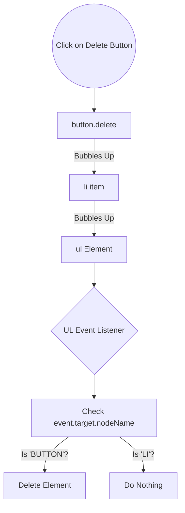

# 🎭 Lecture 03: Event Delegation

Welcome back coders! Aaj hum padhenge **Event Delegation**. Pichle lecture mein humne Todo App banaya tha, par ek bohot bada problem face kiya tha: naye (dynamically created) tasks delete nahi ho rahe the. Aaj hum us problem ko solve karenge using the **Event Delegation** pattern. Yeh topic sirf mini-project ke liye nahi, balki interviews ke liye bhi super important hai! 🚀

---

## 📑 Table of Contents
1. [Mental Model & Concept Overview](#-mental-model--concept-overview)
2. [The Problem: Dynamic Elements](#-the-problem-dynamic-elements)
3. [🧠 Conceptual Q&A 1](#-conceptual-qa-1)
4. [The Solution: Event Delegation Pattern](#-the-solution-event-delegation-pattern)
5. [Applying Event Delegation to Todo App](#-applying-event-delegation-to-todo-app)
6. [🧠 Conceptual Q&A 2](#-conceptual-qa-2)
7. [Topper's Additional Context](#-toppers-additional-context)
8. [Real-World Use Cases](#-real-world-use-cases)
9. [Common Mistakes & Gotchas](#-common-mistakes--gotchas)
10. [Connections](#-connections)
11. [Summary & Quick Revision Cheatsheet](#-summary--quick-revision-cheatsheet)
12. [Interview Q&A](#-interview-qa)

---

## 🧠 Mental Model & Concept Overview

Event Delegation ka simple matlab hai: **Apna kaam kisi aur ko delegate (saunp) dena**.

### 🏢 Real-life Analogy
Imagine karo ek office mein 100 employees hain. Har employee ko ek alag phone line dene ke bajaye (jispe bahar se calls aayenge), company ek **Receptionist** rakhti hai. 
Jab bhi koi call aata hai, woh Receptionist (Parent) ke paas aata hai. Receptionist pucchti hai "Aapko kisse baat karni hai?" aur fir call us specific employee (Child) ko transfer kar deti hai. 

Naye employees join karte hain (Dynamic elements) toh unhe bhi apna personal number nahi chahiye, receptionist unki bhi calls handle kar legi! 🤯

### 🔗 Connection to Event Bubbling
Pichle lecture mein humne padha tha **Event Bubbling** — jab child pe click hota hai, toh event bubble hoke parent pe jata hai, fir grandparent pe, etc.
Event Delegation isi **Bubbling** property ka fyada uthata hai. Hum har child pe event listener lagane ke bajaye, sirf Parent pe ek listener laga dete hain!

---

## 🐛 The Problem: Dynamic Elements

Pichle Todo App mein issue kya tha? 

Jab hamara page load hota hai, JS line-by-line chalti hai aur us time jitne elements DOM mein hote hain, unpe Event Listener attach kar deti hai. Par jab hum naya task add karte hain, us naye delete button pe listener attach **nahi** hota. 

### ❌ The Buggy Code
```javascript
let delBtns = document.querySelectorAll(".delete");

for(let delBtn of delBtns) {
    delBtn.addEventListener("click", function() {
        console.log("Item deleted");
        let par = this.parentElement;
        par.remove();
    });
}
// Yeh sirf un buttons pe chalega jo pehle se HTML mein the.
// Naye elements (dynamically created) pe click karne se kuch nahi hoga! 😭
```

---

## 🧠 Conceptual Q&A 1

**Q: Naye delete button pe event listener kyu nahi apply hua automatic?**
**A:** Kyunki `querySelectorAll` sirf current DOM snapshot leta hai. Jab humne `for` loop chalaya, naye buttons exist hi nahi karte the. JS automatically purane loops wapas run nahi karta future elements ke liye.

---

## ✨ The Solution: Event Delegation Pattern

Is problem ko solve karne ka tarika hai **Event Delegation**. Hum button (child) pe listener lagane ki jagah, `<ul>` (parent) pe listener lagayenge. 

### 🛠️ How it works (The Mechanism)
1. Event parent (`ul`) pe attach hota hai.
2. Jab koi child (`li` ya `button`) click hota hai, event bubble hoke `ul` tak jata hai.
3. `ul` ka listener trigger hota hai.
4. Hum check karte hain `event.target` se ki actually click kis element pe hua tha.

### 📊 Diagram: Event Delegation Flow


---

## 🛠️ Applying Event Delegation to Todo App

Ab hum apne Todo App ko fix karenge. Puraana `for` loop hata denge aur Parent (`ul`) pe listner lagayenge.

### ✅ The Fixed Code
```javascript
let ul = document.querySelector("ul");

ul.addEventListener("click", function(event) {
    // event.target hume batata hai kis actual element pe click hua
    console.log("Target:", event.target);
    console.log("NodeName:", event.target.nodeName);

    // Agar humne delete button pe click kiya hai
    if (event.target.nodeName == "BUTTON") {
        let listItem = event.target.parentElement;
        listItem.remove();
        console.log("Task Deleted Successfully! 🎉");
    } else {
        console.log("Clicked somewhere else in UL, ignore.");
    }
});
```
*Note: Humne `event.target.nodeName == "BUTTON"` check kiya kyunki event bubble hoke aayega, lekin action tabhi lena hai jab specific button dabaya jaye.*

---

## 🧠 Conceptual Q&A 2

**Q: `this` aur `event.target` mein Event Delegation ke context mein kya difference hai?**
**A:** 
- `this`: Hamesha woh element hota hai jispe event listener **attach** hua hai (humare case mein `ul`).
- `event.target`: Woh element hota hai jispe originally **click** (ya action) hua hai (humare case mein `button` ya `li`).
Event delegation tabhi possible hai kyunki `event.target` actual clicked element ki information retain karta hai!

---

## 🤓 Topper's Additional Context (Interview Level Insights)

Apna College Delta batch basics clear karta hai, par Top tech companies ke interviews mein yeh concepts deeply puche jate hain. Here's what you need to know to stand out:

### 1. `closest()` Method ke saath Delegation
Kabhi kabhi humare button ke andar `<i>` (icon) hota hai. Agar user icon pe click kare, toh `target` icon ban jayega, aur hamara `if(event.target.nodeName == "BUTTON")` fail ho jayega!
**Pro Solution:**
```javascript
ul.addEventListener("click", function(event) {
    // closest() check karta hai element ya uske ancestors ko
    let deleteBtn = event.target.closest(".delete-btn"); 
    
    if (!deleteBtn) return; // Agar delete button (ya uske andar) click nahi hua, return
    if (!ul.contains(deleteBtn)) return; // Ensure it's inside our UL

    deleteBtn.parentElement.remove();
});
```

### 2. Event Delegation vs Direct Binding (Performance)
| Feature | Direct Binding (`for` loop) | Event Delegation |
| :--- | :--- | :--- |
| **Memory Usage** | High 🔴 (1000 listeners for 1000 items) | Low 🟢 (1 listener on parent) |
| **Dynamic Elements** | Fails ❌ (Requires re-binding) | Works Automatically ✅ |
| **Setup Speed** | Slow (Attaching many listeners) | Fast (Attaching 1 listener) |

### 3. When NOT to use Event Delegation
- **Non-bubbling events:** Kuch events bubble nahi karte, jaise `focus`, `blur`, `mouseenter`, `mouseleave`. Inpe delegation kaam nahi karta.
- **Deep nesting:** Agar deeply nested elements hain aur har click pe parent pe costly computations ho rahi hain, toh performance degrade ho sakti hai.

### 4. Event Delegation in React (Synthetic Events)
Fun Fact: React `<button onClick={...}>` se direct element pe listener nahi lagata! React internally **apna Event Delegation** set up karta hai `root` div par. (React 17 se pehle `document` pe karta tha). So when you use React, you're using event delegation by default!

---

## 🌍 Real-World Use Cases
- **Data Tables:** Delete/Edit/Update buttons har row mein (jaise admin dashboards mein).
- **Infinite Scroll Feeds:** Instagram/Twitter feed pe like/comment buttons. Naye posts aate rehte hain, par like button chalta rehta hai delegation ki wajah se.
- **Dropdown Menus & Accordions:** Dynamic items ko handle karna.

---

## 🚨 Common Mistakes & Gotchas
1. **Forgetting to check the target:** Agar aap `if (event.target...)` condition nahi lagayenge, toh `ul` mein kahin bhi click karne pe `listItem.remove()` trigger ho jayega, jo galat element delete kar dega.
2. **Checking wrong property:** Hamesha `nodeName` (which returns UPPERCASE strings like 'BUTTON') ya classes use karein identify karne ke liye.
3. **Using `this` instead of `event.target`:** Event delegation mein `this` parent (e.g. `ul`) ko refer karta hai, action hamein child `event.target` pe lena hota hai.

---

## 🔗 Connections
- **Previous Lecture (Event Bubbling):** Event delegation is strictly dependent on Event Bubbling. Agar event bubble na kare, delegation is impossible. (e.g., `event.stopPropagation()` by a child will break delegation).
- **Next Lecture (Simon Says Game):** Wahan hum complex event interactions handle karenge, ye clear mental model bahut kaam aayega!

---

## ⚡ Summary & Quick Revision Cheatsheet
> [!TIP] **TL;DR**
> **Event Delegation** is adding a single event listener to a **Parent** element to manage events for all its **Children** (current and dynamically added).

**Recipe for Event Delegation:**
1. Select the **Parent** element.
2. Add an `addEventListener` to the parent.
3. In the callback function, use `event.target` to inspect who actually fired the event.
4. Filter using an `if` statement (`nodeName`, `.classList.contains()`, or `.closest()`).
5. Execute the action if the filter matches.

---

## 🎤 Interview Q&A

**Q1: What is Event Delegation in JavaScript?**
**Ans:** Event delegation is a technique where we attach a single event listener to a parent element instead of attaching multiple listeners to individual child elements. It leverages event bubbling to capture events from child elements as they propagate up the DOM tree.

**Q2: How does Event Delegation help with dynamically added elements?**
**Ans:** Since the event listener is on the parent (which already exists in the DOM), any child added later will automatically have its events caught by the parent's listener due to bubbling. We don't need to manually attach listeners to new elements.

**Q3: Name an event that cannot be delegated.**
**Ans:** `focus` and `blur` events do not bubble, so they cannot be delegated in the standard way. (Though you can use `focusin` and `focusout` which do bubble).
