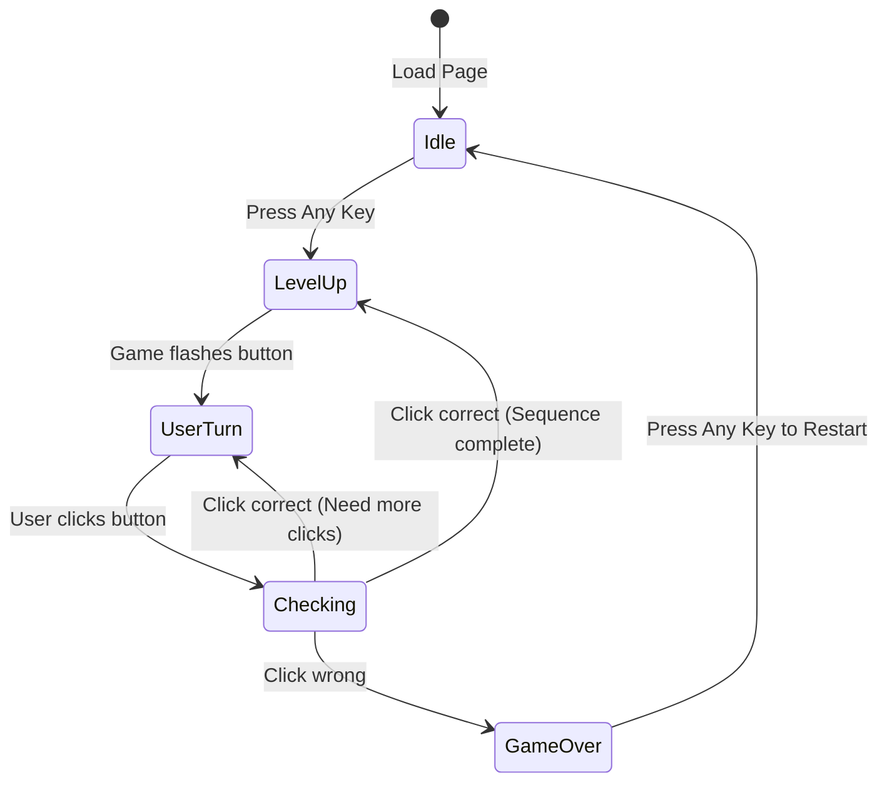

# 🎮 Simon Says Game: 05. Setting up Project

Welcome back, future developers! Aaj hum finally apna **Simon Says Game** banana shuru karenge. Is lecture mein, hum project ka base setup karenge — HTML structure, CSS styling, aur JavaScript mein basic variables aur state management. Ek strong foundation hi ek achhe game ki nishani hai!

---

## 1. 🏗️ Project Overview & File Structure

Sabse pehle, ek naya folder create karein for your project. Is project mein hum standard web development triad follow karenge: HTML, CSS, aur JS.

```text
📁 Simon-Says-Game/
 ├── 📄 index.html  (Makaan ka dhaancha / Structure)
 ├── 📄 style.css   (Makaan ki painting / Styling)
 └── 📄 app.js      (Makaan ki bijli / Logic & Brain)
```

**Real-world Analogy:** 
Jaise ek car ban banane mein body (HTML), paint/design (CSS), aur engine (JavaScript) ki zaroorat hoti hai, waise hi humara game bhi inhi teen pillars par khada hoga.

---

## 2. 📄 HTML Structure

Game ka UI bahut simple hai. Humein chahiye:
1. Ek **Heading** (`<h2>`) jo current level ya instructions dikhayegi.
2. Ek **Container** jisme 4 coloured buttons honge.
3. Chaar (4) alag-alag coloured **Buttons** (Red, Yellow, Green, Purple).

*Complete HTML Code:*

```html
<!DOCTYPE html>
<html lang="en">
<head>
    <meta charset="UTF-8">
    <meta name="viewport" content="width=device-width, initial-scale=1.0">
    <title>Simon Says Game</title>
    <!-- CSS Link -->
    <link rel="stylesheet" href="style.css">
</head>
<body>
    <h1>Simon Says Game</h1>
    <!-- Instruction / Level Indicator -->
    <h2>Press any key to start</h2>

    <!-- Game Container holding all 4 buttons -->
    <div class="btn-container">
        <!-- Top Row -->
        <div class="line-one">
            <div class="btn red" type="button" id="red"></div>
            <div class="btn yellow" type="button" id="yellow"></div>
        </div>
        <!-- Bottom Row -->
        <div class="line-two">
            <div class="btn green" type="button" id="green"></div>
            <div class="btn purple" type="button" id="purple"></div>
        </div>
    </div>

    <!-- JavaScript Link (Always at the end of body) -->
    <script src="app.js"></script>
</body>
</html>
```

### 📝 Line-by-Line Explanation:
- `<h2>Press any key to start</h2>`: Yeh element initial state dikhata hai. Jaise hi game start hoga, DOM manipulation se hum is text ko "Level 1" mein change kar denge.
- `.btn-container`: Yeh main box hai jo charo buttons ko hold karega.
- `.btn`: Ek common class taaki saare buttons ko ek sath style kiya ja sake (size, shape).
- `id="red"`, `id="yellow"`, etc.: Unique IDs taaki hum specific button ko JavaScript mein easily select kar sakein.

---

## 3. 🧠 Conceptual Q&A: HTML decisions

**Q: Humne buttons ko divs (`<div>`) ki tarah kyu banaya, `<button>` tag kyu nahi use kiya?**
**A:** Actually, aap `<button>` tag bhi use kar sakte ho (which is more semantically correct for accessibility). Lekin is game mein, UI ek tile ya block jaisa lagna chahiye (jaise Simon game machine mein hote hain). `<div>` ko CSS se customize karke "tile" wala look dena thoda easier aur standard approach hai in many such tutorials.

**Q: JS file `<script src="app.js"></script>` hamesha `</body>` ke just upar kyu lagate hain?**
**A:** Taaki HTML pehle puri tarah load aur parse ho jaye. Agar JS pehle load ho gaya aur elements abhi bane hi nahi (DOM is not ready), toh `document.querySelector` null return karega.

---

## 4. 🎨 CSS Styling

CSS mein humein center-alignment aur ek 2x2 grid jaisa layout chahiye. Hum yahan Flexbox use karenge.

*Complete CSS Code (`style.css`):*

```css
body {
    text-align: center; /* Centers h1 and h2 */
    background-color: #222; /* Dark theme looking good */
    color: white;
    font-family: 'Arial', sans-serif;
}

.btn-container {
    display: flex;
    justify-content: center; /* Horizontally center */
    margin-top: 50px;
}

.btn {
    height: 150px;
    width: 150px;
    border: 5px solid black;
    border-radius: 20%; /* Makes edges rounded like a squircle */
    margin: 10px;
    cursor: pointer;
}

/* Specific Button Colors */
.red { background-color: #d95980; }
.yellow { background-color: #f99b45; }
.green { background-color: #63aac0; }
.purple { background-color: #819ff9; }

/* Flash animation classes (to be toggled via JS) */
.flash {
    background-color: white !important; /* Flash to white */
    box-shadow: 0 0 20px white; /* Glow effect */
}

.userflash {
    background-color: green !important; /* User click flash */
    box-shadow: 0 0 20px green;
}
```

### 💡 Layout Techniques Explained:
- **Flexbox Centering:** `.btn-container` mein `justify-content: center` lagane se container screen ke beech mein aa jata hai. `.line-one` aur `.line-two` aapas mein flex items behave karte hain, leading to a nice 2x2 grid if we use proper wrappers, or simply `display: flex; flex-direction: column` on the `.btn-container` to stack two rows (or inline-blocks, flexwrap).
- **Flash Animation Class:** `.flash` class hum `.btn` elements par JS ke through add/remove karenge. Jab class add hogi, color white hoga, and then `setTimeout` ke baad class remove ho jayegi, creating a "blink" effect.

---

## 5. 🧠 Conceptual Q&A: CSS decisions

**Q: `.flash` class mein `!important` kyu use kiya?**
**A:** Specificity issue se bachne ke liye. Humari `.red` class ne background color pehle hi define kiya hua hai. Jab hum `.flash` class add karte hain, toh hum chahte hain ki white color `.red` ko override kare. `!important` ensures that the flash effect forces the background color to change.

**Q: Animations JavaScript se karni chahiye ya CSS se?**
**A:** CSS classes bana ke rakhna (`flash`) aur unhe JS se toggle karna is the best practice! Direct JS se `element.style.backgroundColor = 'white'` karna scale karne par messy ho jata hai. CSS handles styling, JS handles logic.

---

## 6. ⚙️ JavaScript - Initial Variables & State Setup

Kahin par bhi game banane ke liye sabse important hoti hai uski **State** track karna. State matlab current situation (score kya hai, konsa level hai, game over hua ya nahi).

*Initial Code (`app.js`):*

```javascript
// ==========================================
// 1. GAME STATE VARIABLES
// ==========================================

// gameSeq keeps track of the pattern generated by the game
let gameSeq = []; 

// userSeq keeps track of the pattern entered by the user
let userSeq = []; 

// Array to easily pick random colors based on index (0,1,2,3)
let btns = ["yellow", "red", "purple", "green"]; 

// Boolean flag to track if the game is currently running
let started = false; 

// Tracks the current level (also acts as our score)
let level = 0; 

// ==========================================
// 2. DOM ELEMENT SELECTIONS
// ==========================================
let h2 = document.querySelector("h2"); // To update level instructions
```

### 🧩 Logic Breakdown:
- `gameSeq` aur `userSeq` array hain. Jaise-jaise game badhega, sequence lambi hogi. Arrays ordered data store karne ke liye perfect hain. 
  - (e.g. `gameSeq = ['red', 'green']`, toh `userSeq` ko bhi exactly `['red', 'green']` push karna padega jeetne ke liye).
- `btns` array humein `Math.random()` use karke ek random color pick karne mein help karega.
- `started` variable prevents double starts. Agar koi baar-baar "start" key dabaye, toh game multiple times reset ya restart na ho.

---

## 7. 🧠 Conceptual Q&A: State Management

**Q: Why do we need TWO separate arrays (`gameSeq` aur `userSeq`)? Ek array se kaam nahi chalega?**
**A:** Game logic kehta hai ki har level par user ko **shuru se** sequence enter karni padti hai. 
- `gameSeq` master copy hai (answer key).
- `userSeq` user ka current attempt hai (student's answer sheet). 
Har button press par hum check karenge: `userSeq[i] === gameSeq[i]`. Agar true, badhiya. Agar false, GAME OVER.

**Q: `started` boolean flag kyu zaroori hai?**
**A:** Event listener keyboard press par sunta hai game start karne ke liye. Jab tak game chal raha hai, aur keys press hongi toh game dobara start nahi hona chahiye. `if(started == false)` check karke hum prevent karte hain restart hona.

**Q: How does `level` variable track progress?**
**A:** `level` 0 se start hota hai. Jaise hi next sequence generate hoti hai, `level++` hota hai aur hum `h2.innerText = "Level " + level` set karte hain. In this game, tumhara level hi tumhara final Score hota hai!

---

## 8. 🏆 Topper's Additional Context

Aaiye game dev ke kuch advanced fundas samajhte hain jo aapko bheed se alag banayenge:

### 1. `const` vs `let` for State Arrays
Notice kiya humne `let gameSeq = []` use kiya hai? Aap `const gameSeq = []` bhi use kar sakte ho. Kyu?
Kyunki array ek reference type hai. Agar aap `const` banate ho, toh aap still usme `.push()` kar sakte ho (modify kar sakte ho). Lekin jab game reset hoga, toh aap `gameSeq = []` directly nahi likh paoge (re-assignment error). Isliye reset mein asani ke liye `let` is perfectly fine here.

### 2. Best Practice: CSS Variables (Custom Properties)
Colors ko baar-baar hex code mein likhne ki jagah variables mein set karna is standard industry practice.

```css
:root {
  --color-red: #d95980;
  --color-flash: white;
}
.red { background-color: var(--color-red); }
```
Aisa karne se, kal ko "Dark Mode" ya "Neon Theme" banani ho, toh bas `:root` mein change karna hoga.

### 3. Architecture of Simon Says
Game flow can be visualised like this state machine:



---

## 9. 🔗 Connection to Next Video (Start Game)

Agli video mein hum **Start Game Logic** likhenge. Hum ek global Event Listener (`keypress`) lagayenge jo hamare `started` flag ko `true` karega. Uske baad pehla button flash hoga aur actual gameplay shuru hoga! State management is setup, abb engine start karne ki baari hai. 🔥

---

## 10. 📝 Summary & Cheatsheet

| Concept | What it does in our Game | Why it's important |
| :--- | :--- | :--- |
| **`.flash` Class** | Button ko temporarily white karna | Visual feedback to user (blinking effect) |
| **`gameSeq` Array** | System generated sequence store karta hai | The "Answer Key" for the level |
| **`userSeq` Array** | User ki clicks store karta hai | Validates against `gameSeq` |
| **`started` Flag** | True/False boolean tracking game state | Prevents game from restarting midway |
| **`level` Variable** | Track the current difficulty / score | Shows progress to the user via DOM |

**Cheatsheet Formulas:**
Total Score for Simon Says = $Level - 1$
(Agar aap level 5 par out hue, aapka score 4 hoga kyunki aapne 4 levels clear kiye the).

Keep practicing, and see you in the next lecture where we bring this game to life! 🚀
