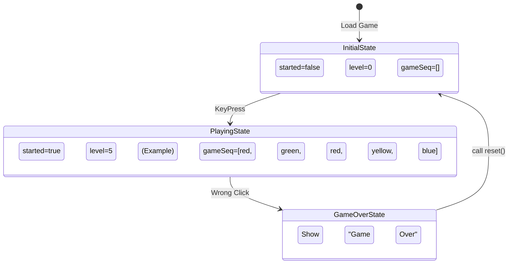

# 🔄 10. Reset Game

Welcome back, future top coders! 🚀 Aaj hum apne **Simon Says Game** ka final missing piece add karenge: **Game Reset**. Jab player out ho jaye, toh game apne aap restart nahi hona chahiye, balki fresh start ke liye ek dam clean state mein aana chahiye.

---

## 🔄 Why Reset Matters

Game state management development ka ek bahut important hissa hai. "State" ka matlab hai variables jo current game situation (level, sequence, etc.) ko store karte hain. 

Jab user out hota hai (Game Over), tab hamare variables `gameSeq`, `userSeq`, aur `level` puraane values hold kar rahe hote hain. Agar hum inko explicitly empty ya `0` na karein, toh naya game ussi wrong state se shuru ho jayega! Isiliye ek dedicated `reset()` function banana zaroori hai.

---

## 🛠 `reset()` Function Code & Explanation

Chalo dekhte hain game variables ko clean slate pe kaise lana hai:

```javascript
// Step 1: Ek reset function declare karo
function reset() {
    started = false; // Game start status false kar do, taaki next key press pe start ho
    gameSeq = [];    // Purane game ka sequence clear kar do
    userSeq = [];    // User ka sequence bhi reset
    level = 0;       // Level wapas 0 se start
}

// Step 2: Kahan call karna hai?
function checkAns(idx) {
    if (userSeq[idx] === gameSeq[idx]) {
        if (userSeq.length == gameSeq.length) {
            setTimeout(levelUp, 1000);
        }
    } else {
        h2.innerText = `Game Over! Press any key to start.`;
        reset(); // Yahan reset call karenge! 🚀
    }
}
```

> **Topper's Tip:** `reset()` function keval variables ko unki initial (start) values par wapas lata hai. Hum kisi event listener ko hatate nahi hain (like `document.addEventListener("keypress", ...)`), bas flag `started` ko `false` kar dete hain taaki agla keypress naya game trigger kare.

---

## 🧠 Conceptual Q&A

**Q: What happens if we forget to reset `started`?**
A: Agar `started` reset nahi hua (`started == true` hi reh gaya), toh `document.addEventListener("keypress", ...)` wali condition fail ho jayegi (kyunki if(`started == false`) check hai) aur game dobara kabhi restart hi nahi hoga naye keypress se.

**Q: What happens if we forget to reset `gameSeq`?**
A: Agar `gameSeq` waisa hi reh gaya, toh next game start hone par naye colors ussi puraane array mein push honge. Player ko ek nayi choti sequence ke bajaye seedhe ek lamba, pichla continued sequence yaad rakhna padega! (Gajab ka unfair ho jayega 😅).

**Q: Should we also remove event listeners during reset?**
A: Is simple game mein zaroorat nahi hai. Hum buttons pe multiple click event listeners add nahi kar rahe hain har level par (humne code ko optimize rakha hai). Agar aisi galti karte jahan har `levelUp` par naya event listener add ho raha ho, tab unko zaroor remove karna padta, warna memory leak ho jata!

**Q: What's the difference between resetting variables vs creating new ones?**
A: Hum variables ko "re-assign" kar rahe hain (`gameSeq = []`). Agar hum local variables `let gameSeq = []` banayenge `reset()` ke andar, toh woh global scope wale variables ko update nahi karenge. Game state variables always global (ya common scope) hone chahiye.

---

## 📊 State Management Diagram (Before and After Reset)



---

## 💡 Topper's Additional Context

Interviewer aapse game states ke baare mein kuch advanced sawal pooch sakta hai:

1. **State Management Patterns:** Abhi humne 4 alag variables (`started`, `gameSeq`, etc.) banaye hain. Pro-level code mein hum in sabko ek single state object mein bind kar sakte hain:
   ```javascript
   let gameState = {
       isStarted: false,
       sequence: [],
       userSequence: [],
       level: 0
   };
   // reset is easy:
   gameState = { isStarted: false, sequence: [], userSequence: [], level: 0 };
   ```
2. **Factory Function Pattern:** Initial state return karne wala ek function bana lo:
   ```javascript
   const getInitialState = () => ({ started: false, level: 0, gameSeq: [] });
   let state = getInitialState();
   function reset() { state = getInitialState(); }
   ```
3. **Memory Leaks:** Humesha ensure karein ki DOM elements pe lagaaye gaye event listeners ek hi baar lagein. Bar-bar add karne se performance gir jayegi.

---

## 📝 Complete Game Code (So Far)

```javascript
let gameSeq = [];
let userSeq = [];

let btns = ["yellow", "red", "purple", "green"];

let started = false;
let level = 0;

let h2 = document.querySelector("h2");

document.addEventListener("keypress", function () {
    if (started == false) {
        console.log("game is started");
        started = true;
        levelUp();
    }
});

function gameFlash(btn) {
    btn.classList.add("flash");
    setTimeout(function () {
        btn.classList.remove("flash");
    }, 250);
}

function userFlash(btn) {
    btn.classList.add("userflash");
    setTimeout(function () {
        btn.classList.remove("userflash");
    }, 250);
}

function levelUp() {
    userSeq = [];
    level++;
    h2.innerText = `Level ${level}`;

    let randIdx = Math.floor(Math.random() * 3);
    let randColor = btns[randIdx];
    let randBtn = document.querySelector(`.${randColor}`);
    
    gameSeq.push(randColor);
    console.log(gameSeq);
    gameFlash(randBtn);
}

function checkAns(idx) {
    if (userSeq[idx] === gameSeq[idx]) {
        if (userSeq.length == gameSeq.length) {
            setTimeout(levelUp, 1000);
        }
    } else {
        h2.innerText = `Game Over! Press any key to start.`;
        reset(); // The missing piece added!
    }
}

function btnPress() {
    let btn = this;
    userFlash(btn);

    userColor = btn.getAttribute("id");
    userSeq.push(userColor);

    checkAns(userSeq.length - 1);
}

let allBtns = document.querySelectorAll(".btn");
for (btn of allBtns) {
    btn.addEventListener("click", btnPress);
}

function reset() {
    started = false;
    gameSeq = [];
    userSeq = [];
    level = 0;
}
```

---

## ⚡ Summary & Cheatsheet

- **Resetting State:** Game ke complete hone par application state ko start values (default values) par reset karna zaroori hai.
- **Global Variables:** Ensure your `reset()` function is modifying the global state variables, not creating new local ones.
- **Clean State = Clean Play:** Without reset, previous game arrays will interfere with the logic of the new game.

---

## 🎯 Interview Q&A

**Q: Can we use `window.location.reload()` instead of `reset()`?**
**A:** Yes, hum page ko refresh karke bhi game reset kar sakte hain. Lekin SPA (Single Page Applications) ya modern web dev mein yeh ek bad practice hai. Page refresh karna resources waste karta hai. State ko code ke through handle karna professional tareeka hai.
